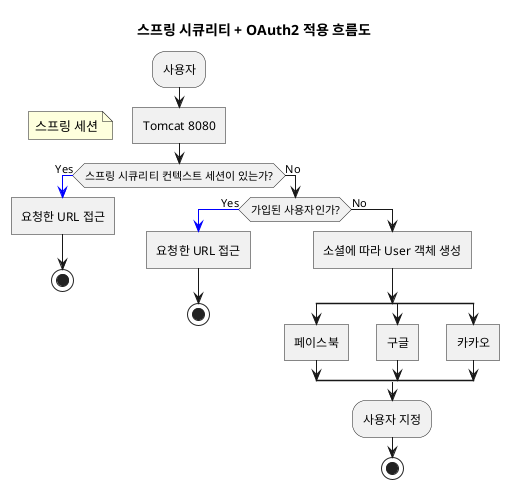
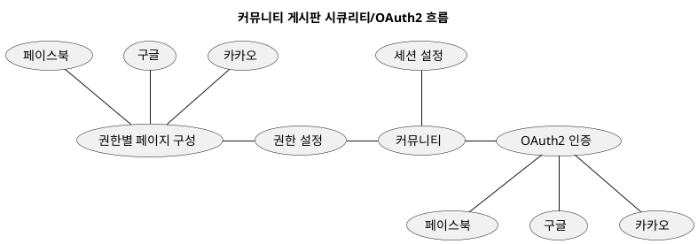

# 처음 배우는 스프링 부트2
## 5. 스프링 부트 시큐리티 + OAuth2
스프링 부트 프레임워크는 인증과 권한에 관련된 강력한 기능인 스프링 부트 시큐리티를 제공함
스프링 부트 시큐리티는 스프링 시큐리티의 번거로운 설정을 간소화 시켜주는 래핑 프레임워크

## 5.1 배경지식 소개
스프링 부트 시큐리티는 스프링 시큐리티에 스타터를 제공해 더 빠른 설정을 지원하는 프로젝트임

### 1. 스프링 부트 시큐리티
스프링 부트 시큐리티에서 가장 중요한 개념
#### 인증(Authentication)
사용자(클라이언트)가 애플리케이션의 특정 동작에 관하여 허락(인증)된 사용자인지 확인하는 절차
웹사이트 로그인을 인증이라 생각하면 됨

#### 권한부여(Authorization)
데이터나 프로그램 등의 특정 자원이나 서비스에 접근할 수 있는 권한을 허용하는 것
예를 들어 A는 VIP 회원이고, B는 일반 회원이라면 두 회원의 권한이 다르게 부여됨

#### 그외 인증방식
- 크리덴셜(Credential) 기반 인증 방식: 사용자명(Principle)과 비밀번호(Credential)로 인증하는 전통적인 인증 방식
- 이중 인증 방식: OTP와 같이 추가적인 인증 방식을 도입에 한번에 2가지 방법으로 인증하는 방식
- OAuth2 인증 방식: 소셜 미디어를 사용해 편리하게 인증하는 방식

### 2. OAuth2
OAuth는 토큰을 사용한 범용적인 방법의 인증을 제공하는 표준 인증 프로토콜
OAuth2는 OAuth 프로토콜의 버전 2 서드파티(3rd party)를 위한 범용적인 인증 표준

#### OAuth2에서 제공하는 승인 타입 4가지
##### 권한 부여 코드 승인 타입(Authorization Code Grant Type)
클라이언트가 다른 사용자 대신 특정 리소스에 접근을 요청할 때 사용됨
리소스 접근을 위한 사용자명과 비밀번호, 권한 서버에 요청해서 받은 권한 코드를 함께 활용하여 리소스에  
대한 엑세스 토큰을 받으면 이를 인증에 이용하는 방식

페이스북, 구글, 카카오 등의 소셜 미디어 들이 웹 서버 형태의 클라이언트를 이 방식으로 지원  
웹 서버에서 장기 엑세스 토큰(long-lived access token)을 사용하여 사용자 인증을 처리

##### 암시적 승인 타입(Implicit Grant Type)
권한 부여 코드 승인 타입과 다르게 권한 코드 교환 단계 없이 엑세스 토큰을 즉시 반환받아 이를 인증에 이용하는 방식

##### 리소스 소유자 암호 자격 증명 승인 타입(Resource Owner Password Credentials Grant Type)
클라이언트가 암호를 사용하여 엑세스 토큰에 대한 사용자의 자격 증명을 교환하는 방식

##### 클라이언트 자격 증명 승인 타입(Client Credentials Grant Type)
클라이언트가 컨텍스트 외부에서 엑세스 토큰을 얻어 특정 리소스에 접근을 요청할 때 사용하는 방식 

```puml
header Authorization Code Grant Type
title 권한 부여 코드 승인 타입 시퀀스 다이어그램

participant 리소스_주인
클라이언트 -> 권한서버: 권한 부여 코드 요청

activate 권한서버
rnote over 권한서버
  client_id, redirect_url,
  response_type=code의 파라미터로 
  요청하면 코드값 반환
end rnote
리소스_주인 -> 권한서버: 로그인
권한서버 --> 클라이언트: 권한 부여 코드 응답
deactivate 권한서버

클라이언트 -> 권한서버: 엑세스 토큰으로 교환 요청
activate 권한서버
rnote over 권한서버
  client_id, client_secret, redirect_url,
  grant_type=authorization_code를 사용하여 권한 부여 코드 반환
end rnote
클라이언트 <-- 권한서버: 엑세스 토큰 응답
deactivate 권한서버

loop 
  클라이언트 -> 리소스_서버: 엑세스 토큰을 사용하여 API 호출
  activate 리소스_서버
  클라이언트 <-- 리소스_서버: 요청한 데이터 응답
  deactivate 리소스_서버
end
```


- 리소스 주인(resource owner): 인증이 필요한 사용자
- 클라이언트(client): 웹사이트
- 권한 서버(authorization server): 페이스북/구글/카카오 서버
- 리소스 서버(resource server): 페이스북/구글/카카오 서버

1. 클라이언트가 파라미터로 클라이언트 ID, 리다이렉트 URI, 응답 타입을 code로 지정하여 권한서버에 전달  
정상적으로 인증이 되면 권한 부여 코드를 클라이언트에 보냄(응답 타입은 code, token이 사용 가능  
응답 타입이 token일 때가 암시적 승인 타입에 해당함)

2. 성공적으로 권한 부여 코드를 받은 클라이언트는 권한 부여 코드를 사용하여 엑세스 토큰(access token)을  
권한 서버에 추가로 요청함  
이때 필요한 파라미터는 클라이언트 ID(client-id), 클라이언트 비밀번호(client-secret), 리다이렉트 URI, 인증 타입임

3. 마지막으로 응답받은 엑세스 토큰을 사용하여 리소스 서버에 사용자의 데이터를 요청함

> 엑세스 토큰  
로그인 세션에 대한 보안 자격을 증명하는 식별 코드
사용자, 사용자 그룹, 사용자 권한 및 경우에 따라 특정 API 사용을 보증하는 역할을 함

## 5.2 스프링 부트 시큐리티 + OAuth2 설계하기


1. 사용자가 애플리케이션에 접속하면 해당 사용자에 대해 이전 로그인 정보(세션)의 유무를 체크

2. 세션이 있으면 그대로 세션을 사용하고, 없으면 OAuth2 인증 과정을 거치게 됨

3. 이메일을 키값으로 사용하여 이미 가입된 사용자인지 체크  
이미 가입된 사용자라면 등록된 정보를 반환하여 요청한 URL로의 접근을 허용하고, 아니라면 새롭게 User 정보를 저장하는 과정을 진행

4. 각 소셜 미디어에서 제공하는 User 정보가 다르기 때문에 소셜 미디어에 따라 User 객체를 생성한 후 DB에 저장함  

**! 세션이 있거나 성공한 사용자는 요청한 URL로의 접근을 허용함**


##### 소셜 미디어 계정으로 커뮤니티 게시판에 로그인하는 FLOW



## 5.3 스프링 부트 시큐리티 + OAuth2 의존성 설정하기
스프링 부트 버전을 `1.5.22.RELEASE` 로 변경  
dependencies에 아래의 내용 추가  
```groovy
compile('org.springframework.security.oauth:spring-security-oauth2')
```

## 5.4 스프링 부트 시큐리티 + OAuth2 구현하기 
프로젝트를 구현하기 전 페이스북, 구글, 카카오의 개발자센터에서 '클라이언트 ID'와  
'Secret(클라이언트 시크릿 키값, 클라이언트 보안 비밀)'을 발급

### 페이스북, 구글, 카카오 개발자센터 연동
#### 1. 페이스북 연동
https://developer.facebook.com/apps

1. 새 앱을 추가하는 버튼을 누르고 앱ID와 자신의 이메일을 입력하여 앱ID를 생성
2. 생성된 앱 ID로 들어가서 'Facebook로그인' 선택 후 설정화면 진입
3. '유효한 OAuth 리다이렉션 URI'를 설정
- 스프링 부트 1.5 버전용
    - http://localhost:8080/login/oauth2/client/facebook
- 스프링 부트 2.0 버전용 
    - http://localhost:8080/login/oauth2/code/facebook
4. 메뉴 - 설정 - 기본 설정에서 앱ID와 앱 시크릿 코드 확인

#### 2. 구글 연동
https://console.cloud.google.com

1. 프로젝트 생성
2. API 및 서비스 - 사용자 인증 정보 로 이동
3. '사용자 인증 정보 만들기'에서 'OAuth 클라이언트 ID' 선택
4. 'OAuth 동의 화면' 제품 이름에 원하는 문구 입력
5. 구글의 OAuth 클라이언트를 만들기 위해 애플리케이션의 유형과 리다이렉션 URI 입력
- 스프링 부트 1.5 버전용
    - http://localhost:8080/login/oauth2/client/facebook
- 스프링 부트 2.0 버전용 
    - http://localhost:8080/login/oauth2/code/facebook
6. 완료 후 사용자 인증 정보 페이지로 이동
7. 생성한 앱을 클릭하고 상세화면에서 '클라이언트 ID'와 '클라이언트 보안 비밀'을 사용하여 애플리케이션 연동 시작

#### 3. 카카오 연동
https://developers.kakao.com/apps

1. 앱 만들기
2. 설정 클릭
3. 플랫폼 - 플랫폼 추가 - 웹 선택 후 도메인명 입력
- http://localhost:8080
4. 사용자 관리에서 로그인 동의항목 저장 후 로그인 Redirect URI 추가
- 스프링 부트 2.0 버전용
    - http://localhost:8080/login/oauth2/code/kakao
5. 애플리케이션 개발 시 REST API 키 사용

### 1. SNS 프로퍼티 설정 및 바인딩
소셜 미디어 연동을 위해 필요한 기본적인 프로퍼티 정보
- clientId: OAuth 클라이언트 사용자명으로 OAuth 공급자가 클라이언트를 식별하는 데 사용함
- clientSecret: OAuth 클라이언트 시크릿 키값
- accessTokenUri: 엑세스 토큰을 제공하는 OAuth의 URI
- userAuthorizationUri: 사용자가 리소스에 접근하는 걸 승인하는 경우 리다이렉션할 URI로 소셜 미디어에 따라 필요 없는 경우도 있음
- scope: 리소스에 대한 접근 범위를 지정하는 문자열로 쉼표로 구분하여 여러 개 지정할 수 있음
- userInfoUri: 사용자의 개인정보 조회를 위한 URI

### 2. 시큐리티 + OAuth2 설정하기
스프링 부트 1.5 버전 시큐리티와 OAuth2를 설정

## 3. 어노테이션 기반으로 User 정보 불러오기
인증된 User의 개인정보를 저장하고 직접 User 정보를 불러오기
보통 User와 관련된 개인정보는 세션에 저장함

#### 인증 처리 후 User 정보 세션 처리
```puml
title 인증 처리 후 User 정보 세션 처리
:OAuth2 인증 성공 시>
:UserArgumentResolver(filter)]
:supportsParameter 체크;
-[#blue]-> Yes;
if (세션에 User가 있는지 여부 체크) then (Yes)
-[#blue]-> 
else (No)
:User 객체 생성 후 권한 부여]
->
:User 세션 저장]
endif
-[#gray,bold]->
:User 파라미터 바인딩;
```


인증 프로세서가 최종까지 완료되면 설정된 성공 URL로 이동함

인증된 User 정보를 세션에 저장해주는 기능 생성