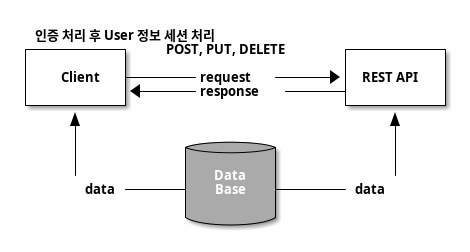
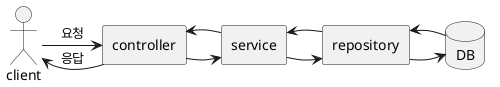
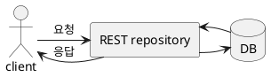

# 처음 배우는 스프링 부트2
##  6. 스프링 부트 데이터 레스트
REST(Representational State Transfer)는 웹의 장점을 극대화하는 통신 네트워크 아키텍처 이며  
REST의 구현 원칙을 제대로 지키는 시스템을 RESTful 이라고 함

## 6.1 배경지식
### 1. REST 소개
REST는 웹과 같은 분산 하이퍼미디어 시스템에서 사용하는 통신 네트워크 아키텍처로 네트워크 아키텍처의 원리 모음

웹은 전송 방식으로 HTTP를 식벽 방법으로 URI를 사용

HTTP는 웹에서 GET, POST, PUT, DELETE 등의 메서드를 사용하여 정보를 주고받는 프로토콜

REST는 HTTP와 URI의 단순하고 간결한 장점을 계승한 네트워크 아키텍처

#### REST의 목적
- 구성요소 상호작용의 규모 확장성
- 인터페이스의 범용성
- 구성요소의 독립적인 배포
- 중간적 구성요소를 이용한 응답 지연 감소, 보안 강화, 레거시 시스템 인캡슐레이션

### 2. RESTful 제약 조건
##### 클라이언트-서버(client-server)
이 제약 조건의 기본 원칙은 관심사의 명확한 분리  
관심사의 명확한 분리가 선행되면 서버의 구성요소가 단순화되고 확장성이 향상되어 여러 플랫폼을 지원할 수 있음

##### 무상태성(stateless)
서버에 클라이언트의 상태 정보를 저장하지 않는 것을 말함  
단순히 들어오는 요청만 처리하여 구현을 더 단순화함  
클라이언트의 모든 요청은 서버가 요청을 알아듣는 데 필요한 모든 정보를 담고 있어야 함

##### 캐시 기능(cacheable)
클라이언트의 응답을 캐시할 수 있어야 함  
앞에서 HTTP의 장점을 그대로 계승한 아키텍처가 REST라고 함  
HTTP의 캐시 기능도 적용할 수 있음

##### 계층화 시스템(layered system)
서버는 중개 서버(게이트웨이, 프록시)나 로드 밸런싱, 공유 캐시 등의 기능을 사용하여 확장성 있는 시스템을 구성할 수 있음

##### 코드 온 디맨드(code on demand)
클라이언트는 서버에서 자바 애플릿, 자바스크립트 실행 코드를 전송받아 기능을 일시적으로 확장할 수 있음  
이 제약 조건은 선택 가능함

##### 인터페이스 일관성(uniform interface)
URI(통합 자원 식별자)로 지정된 리소스에 균일하고 통일된 인터페이스를 제공함  
아키텍처를 단순하게 분리하여 독립적으로 만들 수 있음

#### 인터페이스 일관성
인터페이스 일관성은 세부 원칙을 갖고 있음  
인터페이스 일관성이 잘 지켜졌는지에 따라 REST를 제대로 사용했는지 판단할 수 있음

인터페이스 일관성의 4가지 프로퍼티
- 자원식별  
```
http://localhost:8080/resource/1
```
- 메시지를 통한 리소스 조작
```
http://localhost:8080/resource/1
content-type: application/json
```

- 자기 서술적 메시지
```
GET http://localhost:8080/resource/1
content-type: application/json
```

- 애플리케이션 상태에 대한 엔진으로서의 하이퍼미디어(hypermedia as the engine of application state.HATEOAS)  
HATEOAS는 클라이언트에 응답할 때 단순히 결과 데이터만 제공해주기보다는 URI를 함께 제공해야 한다는 원칙  
하이퍼텍스트 링크처림 관련된 리소스 정보를 포함한다
    - 클라이언트는 관련된 특정 동작에 따라 탐색할만한 URI 값을 알 수 있음  
    URI는 resource까지 포함하므로 더 명확하며 예측 가능하다
    - 키값이 변하지 않는 한 URI가 변경되더라도 동적으로 사용할 수 있다  
    따라서 서버쪽 코드가 변하더라도 클라이언트 코드를 따로 수정할 필요가 없다

REST의 제약 조건들을 제대로 지키면서 REST 아키텍처를 만드는 것을 **RESTFul** 이라고 함

### 3. REST API 설계하기
서버 한 대가 여러 클라이언트에 대응하려면 REST API가 필요함  
REST API는 다음과 같이 구성해야 함
- 자원(resource): URI
- 행위(verb): HTTP 메서드
- 표현(representations): 리소스에 대한 표현(HTTP Message Body)

#### URI 설계
URI는 웹에 있는 자원의 이름과 위치를 식별함  
URL은 URI의 하위 개념  
URL이 리소스를 가져오는 방법에 대한 위치라면 URI는 문자열을 식별하기 위한 표준

URI는 명사를 사용해야 하며 동사를 피해야 한다  
동사를 표현할 때는 HTTP 메서드인 GET, POST, PUT, DELETE 등으로 다음과 같이 대체해야 함
```
GET http://localhost:8080/api/books
content-type: application/json
```

#### 복수형을 사용하라
URI에서는 명사에 단수형보다는 복수형을 사용해야 함  
/book도 물론 명사고 사용 가능하지만 /books로 리소스를 표현하면 컬렉션(collection)으로 명확하게 표현할 수 있어  
확장성 측면에서 더 좋음
```
{
    books: [
        {
            book: ...
        },
        {
            book: ...
        },
        {
            book: ...
        },
    ]
}
```

컬렉션으로 URI를 사용할 경우 컬렉션을 한번 더 감싼 중첩(nested) 형식으로 사용하는 것이 좋음  
중첩할 경우 아래와 같이 JSON 형태로 _embedded 안에 컬렉션 데이터를 넣어서 반환하면 됨   
```
{
    _embedded: [
        {
            books: ...
        },
        {
            stores: ...
        },
        {...}
    ]
}
```
중첩된 형태로 _embedded 내부에 기존 컬렉션의 키값이 유지되게 보낼 경우 서버의 API 스펙이 변경되더라도  
클라이언트는 따로 코드를 수정할 필요가 없음

#### 행위 설계
| Resource | GET(read)          | POST(create)   | PUT(update)        | DELETE(delete)     |
| -------- | ------------------ | -------------- | :----------------- | ------------------ |
| /books   | book 목록 보기     | 해당 book 추가 | -                  | -                  |
| /books/1 | ID가 1인 book 보기 | -              | ID가 1인 book 수정 | ID가 1인 book 삭제 |

/books 자체가 복수의 book을 의미하므로 books를 게시판에 표현할 때 페이징을 처리하는 값을 추가로 제공할 수도 있음  
추가 값으로 페이지, 크기, 정렬 등의 파라미터를 지정할 수 있음  
아래와 같이 JPA의 Pageable의 프로퍼티 값을 그대로 사용할 수 있음
page, size, sort 파라미터를 따로 지정하지 않으면 서버에서 기본으로 설정한 값으로 반환됨
```
GET http://localhost:8080/api/books?page=0&size=10&sort=desc
content-type: application/json
```

## 6.2 설계하기
REST API를 MVC 패턴을 이용한 방법과 스프링 부트 데이터 레스트를 사용하는 방법으로 구현함


- 클라이언트와 DB가 기존에는 직접 데이터를 주고 받았음
- REST API를 사용하면 클라이언트와 DB 사이를 REST API가 중계하게 됨

REST API에서 노출하고 싶은 데이터만 노출할 수 있으며 데이터를 캐시하여 성능도 향상되는 구조까지 가질 수 있음  
따라서 기존에 직접 데이터를 주고받던 과정인 클라이언트와 DB가 데이터를 주고 받던 관계는 사라짐

### 1. MVC 패턴을 활용하는 방법



### 2. 스프링 부트 데이터 레스트를 활용하는 방법



## 6.3 스프링 부트 MVC 패턴으로 REST API 구현하기
1. 클라이언트와 REST API의 통신을 위한 클라이언트 쪽 스크립트 코드 추가
2. REST API 개발 환경 설정
3. CORS 허용 및 시큐리티 설정
4. 생성, 수정, 삭제 기능 구현

### 1. 준비하기
#### 스프링 부트 웹 수정
1. 커뮤니티 게시판의 /board/form.html Ajax 통신용 스크립트 추가
2. MySQL 런타임 의존성 추가
3. MySQL을 사용하도록 설정

#### 스프링 부트 데이터 레스트 구성
내부 멀티모듈로 구성
- rest-web: MVC 패턴 모듈
- data-rest: 데이터 레스트 방식의 모듈
1. settings.gradle 설정
   ```groovy
   rootProject.name = 'boot-rest'

   include 'data-rest'
   include 'rest-web'
   ```
2. build.gradle 설정

### 2. REST API 구현하기
1. REST API DataSource 및 포트 설정
```yaml
spring:
  datasource:
    url: jdbc:mysql://127.0.0.1:3306/testdb
    username: freelife1191
    password: 1
    driver-class-name: com.mysql.cj.jdbc.Driver
server:
  port: 8081
```

2. BoardType Enum 생성
3. Board 클래스 생성
4. SocialType Enum 생성
5. User 클래스 생성
6. BoardRepository 생성
7. UserRepository 생성
8. BoardRestController 생성

**PagedResources** 객체를 생성하면 링크를 추가한 RESTful 데이터를 생성한다  
인터페이스의 일관성을 위해 HATEOAS를 적용하여 관련 리소스 정보를 추가한다

HATEOAS 링크 예제
```json
"_links": {
    "first": {
        "href": "http://localhost:8081/api/boards?page=0&size=10"
    },
    "self": {
        "href": "http://localhost:8081/api/boards{?page,size,sort,projection}"
    },
    "next": {
        "href": "http://localhost:8081/api/boards?page=1&size=10"
    },
    "last": {
        "href": "http://localhost:8081/api/boards?page=20&size=10"
    }
}
```
- first: 첫 페이지
- self: 자기 자신의 URL의 파라미터 정보
- next: 다음 페이지
- last: 마지막 페이지

위와 같이 페이지 처리에 관련된 정보를 키/값 형식으로 추가할 수 있음  
만약 클라이언트가 위 키값을 사용하여 게시판 페이지의 로직을 처리했다면 관련 URL이 버전업 되거나  
형식이 바뀌더라도 클라이언트에서 따로 로직을 수정할 필요가 없음


http://localhost:8081/api/boards

Board 객체의 페이징 처리된 데이터 확인
```json
{
  "_embedded" : {
    "boards" : [ {
      "title" : "게시글1",
      "subTitle" : "순서1",
      "content" : "콘텐츠",
      "boardType" : "free",
      "createdDate" : "2019-09-02T23:12:06",
      "updatedDate" : "2019-09-02T23:12:06"
    }, {
      "title" : "게시글2",
      "subTitle" : "순서2",
      "content" : "콘텐츠",
      "boardType" : "free",
      "createdDate" : "2019-09-02T23:12:06",
      "updatedDate" : "2019-09-02T23:12:06"
    } ]
  },
  "_links" : {
    "self" : {
      "href" : "http://localhost:8081/api/boards"
    }
  },
  "page" : {
    "size" : 10,
    "totalElements" : 200,
    "totalPages" : 20,
    "number" : 0
  }
}
```

- _embedded: 호출한 목적 데이터가 중첩형식으로 부여되어 있음
- _link: 관련된 링크들이 있음
- page: 페이징 처리를 위한 값들이 제공됨

### 3. CORS 허용 및 시큐리티 설정
출처는 자원+도메인+포트번호로 결합된 문자열임  
이 조합에서 한 글자라도 다르면 다른 출처로 판단됨  
이러한 교차 출처(cross-origin) HTTP 요청을 가능하게 해주는 메커니즘을  
교차 출처 자원 공유(cross origin resource sharing, CORS) 라고 한다  
CORS는 서로 다른 도메인의 접근을 허용하는 권한을 부여한다

```plantuml
title 교차 출처 방식의 시퀀스 다이어그램

participant "웹 클라이언트\n(springboot.com)" as webclient
participant "서버\n(springboot.com)" as server
participant "서버\n(sub.springboot.com)" as server2

group 동일 출처(same orign)
  webclient -> server: home.js 요청
  server --> webclient: home.js 응답
end

group 교차 출처(CORS 사용)
  webclient -> server2: home.js 요청
  server2 --> webclient: CORS를 사용한 home.js 응답
end
```


##### http://springboot.com 에서 허용하는 교차 출처 자원 공유 정책  

| URL                             | 결과                |
| ------------------------------- | ------------------- |
| http://springboot.com/find/task | 성공                |
| http://springboot.com:8080      | 실패(포트 다름)     |
| https://springboot.com          | 실패(프로토콜 다름) |
| http://study.springboot.com     | 실패(호스트 다름)   |

- CORS 적용하기

### 4. 생성, 수정, 삭제 구현
1. REST API 컨트롤러의 POST, PUT, DELETE 메서드 생성
2. Board 객체에 setCreatedDateNow(), update() 메서드 추가

### 5. 동작 확인
API는 8081 포트, 커뮤니티 게시판은 8080 포트로 실행하여 추가된 기능 정상 동작 확인

1. 게시글 저장하기 확인
2. 게시글 수정하기 확인
3. 게시글 삭제하기 확인

## 6.4 스프링 부트 데이터 레스트로 REST API 구현하기
복잡한 로직 없이 단순 요청을 받아 데이터를 있는 그대로 반환할 때 스프링 부트 데이터 레스트를 사용  
MVC 패턴에서 VC를 생략하고 도메인과 Repository로만 REST API를 제공하여 쉽고 빠르게 프로젝트 진행

#### 구현 절차
1. 스프링 부트 데이터 레스트로 REST API 구현하기
2. `@RepositoryRestController`를 사용하여 REST API 구현하기
3. 프로젝션, 롤, 이벤트 바인딩 등 세부적인 설정 처리
4. HAL 브라우저 적용하기

### 1. 준비하기
미리 구현한 data-rest 모듈을 사용해 개발

1. application.yml 생성
```yaml
spring:
  datasource:
    url: jdbc:mysql://127.0.0.1:3306/testdb
    username: freelife
    password: 1
    driver-class-name: com.mysql.cj.jdbc.Driver
  data:
    rest:
      # API의 모든 요청의 기본 경로를 지정함
      base-path: /api
      # 클라이언트가 따로 페이지 크기를 요청하지 않았을 때 적용 할 기본 페이지 크기를 설정
      default-page-size: 10
      # 최대 페이지 수를 설정
      max-page-size: 10
server:
  port: 8081
```

#### 스프링 부트 데이터 레스트 프로퍼티
| 이름                    | 설명                                                         |
| ----------------------- | ------------------------------------------------------------ |
| page-param-name         | 페이지를 선택하는 쿼리 파라미터명을 변경함                   |
| limit-param-name        | 페이지 아이템 수를 나타내는 쿼리 파라미터명을 변경함         |
| sort-param-name         | 페이지의 정렬값을 나타내는 쿼리 파라미터명을 변경함          |
| default-media-type      | 미디어 타입을 지정하지 않았을 때 사용할 기본 미디어 타입을 설정함 |
| return-body-on-create   | 새로운 엔티티를 생성한 이후에 응답 바디(Response Body) 반환 여부를 설정함 |
| return-body-on-update   | 엔티티를 수정한 이후에 응답 바디 반환 여부를 설정함          |
| enable-enum-translation | 'rest-messages'라는 프로퍼티 파일을 만들어서 지정한 enum 값을 사용하게 해줌<br />적합한 enum 값(DEAFAULT, ALL, VISIBILITY, ANNOTATED)을 키로 사용함 |
| detection-strategy      | 리포지토리 노출 전략을 설정하는 프로퍼티값<br />RepositoryDetectionStrategy 인터페이스 내부에 구현된 enum 값으로 설정함 |

### 2. 기본 노출 전략 살펴보기
스프링 부트 데이터 레스트에서 제공하는 프로퍼티 중 `detection-strategy`에 RepositoryDetectionStrategy를 사용하여 Repository의 REST 리소스 노출 여부를 설정할 수 있음

#### RepositoryDetectionStrategy에 주어진 enum 값
- ALL: 모든 유형의 리포지토리를 노출함
- DEFAULT: public으로 설정된 모든 리포지토리를 노출함  
  여기서 `@(Repository)RestResource`가 'exported'로 설정된 flag 값이 고려되어 노출됨
- ANNOTATION: `@(Repository)RestResource`가 설정된 Repository만 노출함  
  여기서 `@(Repository)RestResource`가 'exported'로 설정된 flag 값이 false가 아니어야 함
- VISIBILITY: public으로 설정된 인터페이스만 노출함

### 3. 스프링 부트 데이터 레스트로 REST API 구현하기
`@RepositoryRestResource`는 스프링 부트 데이터 레스트에서 지원하는 어노테이션  
별도의 컨트롤러와 서비스 영역 없이 미리 내부적으로 정의되어 있는 로직을 따라 처리됨  
그 로직은 해당 도메인의 정보를 매핑하여 REST API를 제공하는 역할을 함

1. BoardRepository 생성
```java
package com.community.rest.repository;

import com.community.rest.domain.Board;
import org.springframework.data.jpa.repository.JpaRepository;
import org.springframework.data.rest.core.annotation.RepositoryRestResource;
import org.springframework.stereotype.Repository;

@RepositoryRestResource
public interface BoardRepository extends JpaRepository<Board, Long> {
}
```
2. UserRepository 생성
```java
package com.community.rest.repository;

import com.community.rest.domain.User;
import org.springframework.data.jpa.repository.JpaRepository;
import org.springframework.data.rest.core.annotation.RepositoryRestResource;
import org.springframework.stereotype.Repository;

@RepositoryRestResource
public interface UserRepository extends JpaRepository<User, Long> {
}
```

3. 터미널에서 접속하여 결과 확인
```bash
curl http://localhost:8081/api/boards
```

```json
{
  "_embedded" : {
    "boards" : [ {
      "title" : "게시글1",
      "subTitle" : "순서1",
      "content" : "콘텐츠1",
      "boardType" : "free",
      "createdDate" : "2019-09-03T23:34:17",
      "updatedDate" : "2019-09-03T23:37:23"
    }, {
      "title" : "게시글2",
      "subTitle" : "순서2",
      "content" : "콘텐츠",
      "boardType" : "free",
      "createdDate" : "2019-09-03T23:34:17",
      "updatedDate" : "2019-09-03T23:34:17"
    } ]
  },
  "_links" : {
    "self" : {
      "href" : "http://localhost:8081/api/boards"
    }
  },
  "page" : {
    "size" : 10,
    "totalElements" : 201,
    "totalPages" : 21,
    "number" : 0
  }
}
```

HATEOAS를 지키며 MVC 패턴을 활용한 방법보다 더 많은 링크 정보를 제공함  
boards 키의 내부 "_links"는 해당 Board와 관련된 링크정보를 포함함  
외부 "_links"는 Board의 페이징 처리와 관련된 링크 정보를 포함함  

#### 내부링크에서 알 수 있는 것 
- 해당 Board에 대한 URI
- 프로젝션을 통한 Board 호출 URI
- 해당 Board를 작성한 User의 URI

#### 외부링크에서 알 수 있는 것
- 게시판의 첫 번째 리스트 URI("first")
- 자기 자신의 URI("self")
- 다음 페이지
- 마지막 페이지
- 프로파일 정보 등

위의 정보들은 키값(key:value) 형식으로 구성되어 있어서 클라이언트가 키를 참조하도록 코드를 설정한다면 서버에서 요청된 데이터의 정보가 바뀌더라도 클라이언트 입장에서는 코드를 수정할 필요가 없음

ex) 서버에서 한 페이지의 게시글 수를 10이 아니라 20으로 설정하려고 함  
만약 클라이언트가 URL을 직접 호출하여 가져 온다면  
"http://localhost:8081/api/boards?page=0&size=20"과 같이 수정해야함

클라이언트가 "_links"의 "first" 값을 참조하고 있었다면 서버에서 제공하는 대로 값을 받아오기 때문에 수정할 필요가 없음

### 4. @RepositoryRestController를 사용하여 REST API 구현하기
스프링 부트 데이터 레스트에서 따로 제공해주는 좀 더 최적화된 어노테이션  
#### 두가지 주의사항
1. 매핑하는 URL 형식이 스프링 부트 데이터 레스트에서 정의하는 REST API 형식에 맞아야함
2. 기존에 기본으로 제공하는 URL 형식과 같게 제공해야 해당 컨트롤러의 메서드가 기존의 기본 API를 오버라이드 함

##### API 테스트
```bash
$ curl http://localhost:8081/api/boards
```

##### 최적화한 /api/boards를 호출한 결과 데이터
```json
{
  "_embedded" : {
    "boards" : [ {
      "title" : "게시글1",
      "subTitle" : "순서1",
      "content" : "콘텐츠1",
      "boardType" : "free",
      "createdDate" : "2019-09-03T23:34:17",
      "updatedDate" : "2019-09-03T23:37:23"
    } ]
  },
  "_links" : {
    "self" : {
      "href" : "http://localhost:8081/api/boards"
    }
  },
  "page" : {
    "size" : 10,
    "totalElements" : 201,
    "totalPages" : 21,
    "number" : 0
  }
}
```
- 스프링 부트 데이터 레스트에서 제공해주는 기본 URL은 `@RepositoryRestController`를 사용하여 오버라이드 가능
- 코드로 모든 링크를 추가하는 일은 굉장히 번거로움
  스프링 부트 데이터 레스트는 이러한 반복 작업을 일괄적으로 제공해주기 때문에 링크를 추가하는 코드를 구현할 필요가 없음

### 5. 생성, 수정, 삭제 연동 테스트
#### CORS 적용
rest-web에 적용한 RestWebApplication 의 CORS 적용 부분 카피해서
data-rest의 DataRestApplication 에 적용

### 6. 프로젝션으로 노출 필드 제한하기
사용자 개인정보처럼 민감한 데이터를 다룰 때는 한정된 값만 사용하도록 제한

User 데이너 요청 시 모든 필드를 조회하여 가져옴
```bash
$ curl http://localhost:8081/api/users/1
```

User를 GET하여 얻은 결과
```json
{
  "name" : "havi",
  "password" : "test",
  "email" : "havi@gmail.com",
  "principal" : null,
  "socialType" : null,
  "createdDate" : "2019-09-07T16:57:45",
  "updatedDate" : null,
  "_links" : {
    "self" : {
      "href" : "http://localhost:8081/api/users/1"
    },
    "user" : {
      "href" : "http://localhost:8081/api/users/1"
    }
  }
}
```
#### 스프링 부트 데이터 레스트 반환값을 제어하는 3가지 방법
- 도메인 필드에 `@JsonIgnore`를 추가하는 방법
- `@Projection`을 사용하는 방법
- 프로젝션을 수동으로 등록하는 방법

##### 1. 도메인 필드에 `@JsonIgnore`를 추가하는 방법
`@JsonIgnore`를 추가하는 방법이 가장 간단함  
User 도메인에 `@JsonIgnore` 어노테이션을 사용하면 해당 필드가 반환값에 포함되지 않음
```java
@Column
@JsonIgnore
private String password;
```

##### 2. `@Projection`을 사용하는 방법
상황에 따라 유동적으로 설정하고 싶은 필드가 있을 때   
프로젝션을 설정하여 원하는 필드만 제한할 수 있음  
프로젝션은 사용자에게 제공되는 정보를 줄일 수도 있고 반대로 제공하지 않던 데이터를 가져올 수도 있음

**유의 사항**

- 프로젝션 인터페이스 생성 시 반드시 해당 도메인 클래스와 같은 패키지 경로 또는 하위 패키지 경로에 생성해야 함
- `@RepositoryRestResource` 어노테이션의 excerptProjection 프로퍼티로 관리되는 리소스 참조는 단일 참조 시 적용되지 않음

1. User의 이름만 노출하도록 UserOnlyContainName Projection 설정
```java
import com.community.rest.domain.User;
import org.springframework.data.rest.core.config.Projection;

@Projection(name = "getOnlyName", types = { User.class})
public interface UserOnlyContainName {
    String getName();
}
```
2. UserRepository에 Projection 적용
```java
import com.community.rest.domain.User;
import com.community.rest.domain.projection.UserOnlyContainName;
import org.springframework.data.jpa.repository.JpaRepository;
import org.springframework.data.rest.core.annotation.RepositoryRestResource;

@RepositoryRestResource(excerptProjection = UserOnlyContainName.class)
public interface UserRepository extends JpaRepository<User, Long> {
}
```
3. 프로젝션을 적용하여 User의 이름만 노출 테스트
```bash
$ curl http://localhost:8081/api/users
```
```json
{
  "_embedded" : {
    "users" : [ {
      "name" : "havi",
      "_links" : {
        "self" : {
          "href" : "http://localhost:8081/api/users/1"
        },
        "user" : {
          "href" : "http://localhost:8081/api/users/1{?projection}",
          "templated" : true
        }
      }
    } ]
  },
  "_links" : {
    "self" : {
      "href" : "http://localhost:8081/api/users{?page,size,sort,projection}",
      "templated" : true
    },
    "profile" : {
      "href" : "http://localhost:8081/api/profile/users"
    }
  },
  "page" : {
    "size" : 10,
    "totalElements" : 1,
    "totalPages" : 1,
    "number" : 0
  }
}
```
**유의 사항**

http://localhost:8081/api/users/1 과 같이 단일 참조 시에는 적용되지 않음  

**유의 사항 해결을 위한 3가지 대책**
- /api/users/1?projection=getOnlyName을 적용하면 됨  
- `@JsonIgnore`를 사용하여 특정 필드를 막은 후 상황에 따라 사용할 수 있게 `@Projection`으로 참조를 허용할 수 있으나 복잡하여 추천하지 않음
- 특정 경로에 따라 반환할 데이터가 명확한 방법인 `@RepositoryRestController`를 사용하는 것을 추천함
##### 3. 프로젝션을 수동으로 등록하는 방법
excerptProjection을 설정하지 않고 수동으로 프로젝션을 등록  
수동 등록 시에는 반드시 프로젝션 타깃이 될 도메인과 동일하거나 하위에 있는 패키지 경로로 들어가야함

- RepositoryRestConfiguration 클래스를 사용하여 수동으로 프로젝션 등록
```java
import org.springframework.context.annotation.Configuration;
import org.springframework.data.rest.core.config.RepositoryRestConfiguration;
import org.springframework.data.rest.webmvc.config.RepositoryRestConfigurer;

@Configuration
public class CustomizedRestMvcConfiguration implements RepositoryRestConfigurer {

    @Override
    public void configureRepositoryRestConfiguration(RepositoryRestConfiguration config) {
        config.getProjectionConfiguration().addProjection(UserOnlyContainName.class);
    }
}
```

### 7. 각 메서드 권한 제한
시큐리티 설정에 추가 했던 어노테이션을 이용해 권한관리  
- `securedEnable=true` 설정 시 `@Secured` 사용가능
- `prePostEnabled=true` 설정 시 `@PreAuthorize` 어노테이션 사용가능
```java
`@EnableGlobalMethodSecurity(secureEnabled=true, prePostEnabled=true)
```

##### `@Secured`
순수하게 롤 기반으로 접근을 제한함  
대신 `@Secured`는 권한 지정에 있어서 유연성이 떨어짐

##### `@PreAuthorize`
`@Secured`보다 더 효율적으로 권한 지정을 할 수 있음  
권한 지정 외에도 EL 태그를 사용하여 유연한 관리가 가능함  
Method 레벨과 Repository 레벨 모두 사용할 수 있지만 두 가지를 혼합해 사용하는 방법은 추천하지 않음

1. Board의 제목만 표시하는 프로젝션 생성
```java
import com.community.rest.domain.Board;
import org.springframework.data.rest.core.config.Projection;

@Projection(name = "getOnlyTitle", types = { Board.class })
public interface BoardOnlyContainTitle {
    String getTitle();
}
```
2. `@PreAuthorize`로 save 메서드에 ADMIN 권한 지정하기
```java
import com.community.rest.domain.Board;
import com.community.rest.domain.projection.BoardOnlyContainTitle;
import org.springframework.data.jpa.repository.JpaRepository;
import org.springframework.data.rest.core.annotation.RepositoryRestResource;
import org.springframework.security.access.prepost.PreAuthorize;

@RepositoryRestResource(excerptProjection = BoardOnlyContainTitle.class)
public interface BoardRepository extends JpaRepository<Board, Long> {

    @Override
    @PreAuthorize("hasRole('ROLE_ADMIN')")
    <S extends Board> S save(S entity);
}
```
3. 시큐리티 설정에 권한이 다른 User 추가
```java
@SpringBootApplication
public class DataRestApplication {
    ...
    /**
     * CORS 설정
     */
    @Configuration
    // @PreAuthorize 와 @PostAuthorize 를 사용하기 위해 붙이는 어노테이션
    @EnableGlobalMethodSecurity(prePostEnabled = true)
    // 웹용 시큐리티를 활성화하는 어노테이션
    @EnableWebSecurity
    static class SecurityConfiguration extends WebSecurityConfigurerAdapter {

        /**
         * 인메모리 방식으로 User 정보를 관리해주는 InMemoryUserDetailsManager를 선언함
         * 인메모리 방식은 애플리케이션이 실행될 때 메모리에서 User 정보를 관리하도록 하는 방식임
         * 만약 User에 관한 정보를 애플리케이션 실행 중에 수정하면 애플리케이션이 셧다운될 때 수정했던 정보가 사라짐
         * @return
         */
        @Bean
        InMemoryUserDetailsManager userDetailsManager() {
            User.UserBuilder commonUser = User.withUsername("commonUser").password("{noop}common").roles("USER");
            /*
                일반 User인 commonUser를 생성하고 직접 테스트할 User인 havi도 생성하여 두 User 각각 USER, ADMIN 권한을 부여함
                스프링 시큐리티에서 제공하는 UserBuilder를 사용하면 간편하게 User를 생성할 수 있음
                스프링 부트 2.0(Spring Security 5.0 이상)부터는 암호화 인코딩 방식을 지정해야 함
                예를 들어 sha256 방식은 {sha256}과 같이 지정해야 함
                예제에서는 인코딩 방식을 지정하지 않기 위해 {noop}으로 표기했음
             */
            User.UserBuilder havi = User.withUsername("havi").password("{noop}test").roles("USER", "ADMIN");

            List<UserDetails> userDetailsList = new ArrayList<>();
            userDetailsList.add(commonUser.build());
            /*
                ImMemoryUserDetailsManager 생성 시 필요한 User 목록을 생성함
                UserBuilder를 사용했으므로 build() 메서드로 User를 만들 수 있음
             */
            userDetailsList.add(havi.build());

            return new InMemoryUserDetailsManager(userDetailsList);
        }
        ...
    }
}
```
4. 저장 요청 시 헤더에 User 정보를 포함하도록 수정

ADMIN만 저장할 수 있도록 설정했음  
아래의 코드를 포함하지 않으면 403(AccessDeniedException) 권한없음 예외가 발생함
```javascript
<script th:if="!${board?.idx}">
    $('#insert').click(function () {
        var jsonData = JSON.stringify({
            title: $('#board_title').val(),
            subTitle: $('#board_sub_title').val(),
            content: $('#board_content').val(),
            boardType: $('#board_type option:selected').val()
        });
        $.ajax({
            url: "http://localhost:8081/api/boards",
            type: "POST",
            data: jsonData,
            contentType: "application/json",
            // 권한 인증에 대한 기본 형식 bota는 문자열을 base64로 인코딩해주는 함수
            headers: {
                "Authorization": "Basic " + btoa("havi" + ":" + "test")
            },
            dataType: "json",
            success: function () {
                alert('저장 성공!');
                location.href = '/board/list';
            },
            error: function () {
                alert('저장 실패!');
            }
        });
    });
</script>
```

### 8. 이벤트 바인딩
스프링 부트 데이터 레스트에서는 여러 메서드의 이벤트 발생 시점을 가로채서 원하는 데이터를 추가하거나  
검사하는 총 10개의 REST 관련 이벤트 어노테이션을 제공함

각 이벤트는 `@Handle`+**이벤트명** 형태로 지원됨  
이벤트 생성 클래스에는 `@RepositoryEventHandler`를 선언해주어 해당 클래스가 이벤트를 관리  
어노테이션 기반 외에 직접 이벤트 등록하는 방법도 있음

- `BeforeCreateEvent`: 생성하기 전의 이벤트
- `AfterCreateEvent`: 생성한 후의 이벤트
- `BeforeSaveEvent`: 수정하기 전의 이벤트
- `AfterSaveEvent`: 수정한 후의 이벤트
- `BeforeDeleteEvent`: 삭제하기 전의 이벤트
- `AfterDeleteEvent`: 삭제한 후의 이벤트
- `BeforeLinkSaveEvent`: 관계를 가진(1:1, M:M) 링크를 수정하기 전의 이벤트
- `AfterLinkSaveEvent`: 관계를 가진(1:1, M:M) 링크를 수정한 후의 이벤트
- `BeforeLinkDeleteEvent`: 관계를 가진(1:1, M:M) 링크를 삭제하기 전의 이벤트
- `AfterLinkDeleteEvent`: 관계를 가진(1:1, M:M) 링크를 삭제한 후의 이벤트

#### 1. 게시글 생성 시 생성 날짜, 수정 시 수정 날짜를 서버에서 생성하도록 설정
```java
import com.community.rest.domain.Board;
import org.springframework.data.rest.core.annotation.HandleBeforeCreate;
import org.springframework.data.rest.core.annotation.HandleBeforeSave;
import org.springframework.data.rest.core.annotation.RepositoryEventHandler;

/**
 * Created by freejava1191@gmail.com on 2019-09-07
 * Blog : https://freedeveloper.tistory.com/
 * GitHub : https://github.com/freelife1191
 *
 * 게시글 생성 시 생성 날짜, 수정 시 수정 날짜를 서버에서 생성하도록 설정하는 이벤트 핸들러
 */
@RepositoryEventHandler
public class BoardEventHandler {

    /**
     * 게시글의 생성 날짜를 현재 시간으로 할당
     * @param board
     */
    @HandleBeforeCreate
    public void beforeCreateBoard(Board board) {
        board.setCreatedDateNow();
    }

    /**
     * 게시글의 수정 날짜를 현재 시간으로 할당
     * @param board
     */
    @HandleBeforeSave
    public void beforeSaveBoard(Board board) {
        board.setUpdatedDateNow();
    }
}
```

스프링 부트 데이터 레스트 이벤트를 적용하는 두가지 방법

- 수동으로 이벤트를 적용하는 ApplicationListener를 사용하는 방법  
  AbstractRepositoryEventListener를 상속받고 관련 메서드를 오버라이드하여 원하는 이벤트만 등록할 수 있음
- 사용한 어노테이션을 기반으로 하는 이벤트 처리 방법  
  생성한 이벤트 핸들러 클래스에는 `@RepositoryEventHandler` 어노테이션이 선언되어 있어야 함  
  이 어노테이션은 BeanPostProcessor에 클래스가 검사될 필요가 있음을 알려줌


이벤트 핸들러를 등록하려면 `@Component`를 상용하거나 직접 ApplicationContext에 빈으로 등록해야 함

#### 2. BoardEventHandler 빈으로 등록
```java
import com.community.rest.event.BoardEventHandler;
...
@SpringBootApplication
public class DataRestApplication {

    public static void main(String[] args) {
        SpringApplication.run(DataRestApplication.class, args);
    }

    ...

    @Bean
    BoardEventHandler boardEventHandler() {
        return new BoardEventHandler();
    }
}
```

#### 3. 게시판 글 생성, 수정에 대한 이벤트 테스트 작성
```java
import com.community.rest.domain.Board;
import org.junit.Test;
import org.junit.runner.RunWith;
import org.springframework.boot.test.autoconfigure.jdbc.AutoConfigureTestDatabase;
import org.springframework.boot.test.context.SpringBootTest;
import org.springframework.boot.test.web.client.TestRestTemplate;
import org.springframework.test.context.junit4.SpringRunner;

import static org.assertj.core.api.Assertions.assertThat;

@RunWith(SpringRunner.class)
/*
    스프링 부트 데이터 레스트를 테스트하기 위해 시큐리티 설정이 들어 있는 DataRestApplication 클래스를 주입함
    포트도 설정에 정의되어 있는 8081을 동일하게 사용하기 위해 DEFINED_PORT로 지정하여 사용함
 */
@SpringBootTest(classes = DataRestApplication.class, webEnvironment = SpringBootTest.WebEnvironment.DEFINED_PORT)
/*
    @AutoConfigureTestDatabase 어노테이션은 H2가 build.gradle의 클래스 경로에 포함되어 있으면 자동으로 H2를 테스트 데이터베이스로 지정함
    만약 이 어노테이션을 사용하지 않는다면 테스트에서 Board를 저장할 때마다 실제 데이터베이스에 반영될 겁니다
 */
@AutoConfigureTestDatabase
public class BoardEventTest {
    /*
        TestRestTemplate은 RestTemplate을 래핑한 객체로서 GET, POST, PUT, DELETE와 같은 HttpRequest를 편하게 테스트하도록 도와줌
        예제에서처럼 시큐리티 설정에 ADMIN으로 생성한 'havi'의 정보를 파라미터로 넣어주면 해당 아이디로 권한 인증이 통과됨
        이와 같은 설정을 해주는 이유는 '각 메서드 권한 제한'에서 저장한 메서드에 권한을 ADMIN으로 설정했기 때문
     */
    private TestRestTemplate testRestTemplate = new TestRestTemplate("havi", "test");

    @Test
    public void 저장할때_이벤트가_적용되어_생성날짜가_생성되는가() {
        /*
            Board에 title 값만 부여하여 저장했음
            저장된 Board 객체의 createdDate 값이 null이 아니라면 beforeCreateBoard 메서드가 Board 객체가 저장되기 전에 제대로 실행된 것임
         */
        Board createdBoard = createBoard();
        assertThat(createdBoard.getCreatedDate()).isNotNull();
    }

    @Test
    public void 수정할때_이벤트가_적용되어_수정날짜가_생성되는가() {
        Board createdBoard = createBoard();
        /*
            수정 시 이벤트가 적용되는지 테스트하기 위해 createBoard 메서드를 재사용하여 Board 객체를 생성하고 updateBoard 메서드를 통해 PUT 방식으로 데이터를 수정하는 요청을 보냈음
            수정이 정상적으로 완료된 Board 객체의 updatedDate 값이 null이 아니라면 설정했던 beforeSaveBoard 메서드가 수정되기 전에 제대로 실행된 것임
         */
        Board updatedBoard = updatedBoard(createdBoard);
        assertThat(updatedBoard.getUpdatedDate()).isNotNull();
    }

    private Board createBoard() {
        Board board = Board.builder().title("저장 이벤트 테스트").build();
        return testRestTemplate.postForObject("http://127.0.0.1:8081/api/boards", board, Board.class);
    }

    private Board updatedBoard(Board createdBoard) {
        String updateUri = "http://127.0.0.1:8081/api/boards/1";
        testRestTemplate.put(updateUri, createdBoard);
        return testRestTemplate.getForObject(updateUri, Board.class);
    }
}
```

### 9. URI 처리
URI 경로 관리
- basePath를 '/api'로 설정 시 기본 접속 URI
  ```bash
  http://localhost:8081/api/boards
  ```

BoardRepository 클래스에 추가되어 있는 `@RepositoryRestResource`의 path 기본값은 'boards'
- 경로 변경 테스트를 위해 path를 'notice'로 수정하여 요청
  ```java
  @RepositoryRestResource(path = "notice")
  ```
- URI로 요청하는 모든 검색 쿼리 메서드는 search 하위로 표현됨  
  기본 설정 URI
  ```bash
  http://localhost:8081/api/boards/search
  ```
  ##### 일치하는 제목을 찾는 쿼리 메서드 생성
  ```java
  import com.community.rest.domain.Board;
  import com.community.rest.domain.projection.BoardOnlyContainTitle;
  import org.springframework.data.jpa.repository.JpaRepository;
  import org.springframework.data.repository.query.Param;
  import org.springframework.data.rest.core.annotation.RepositoryRestResource;
  import org.springframework.data.rest.core.annotation.RestResource;
  import org.springframework.security.access.prepost.PreAuthorize;

  import java.util.List;
  /**
  * @RepositoryRestResource 별도의 컨트롤러와 서비스 영역 없이 미리 내부적으로 정의되어 있는 로직을 따라 처리됨
  * 그 로직은 해당 도메인의 정보를 매핑하여 REST API를 제공하는 역할을 함
  */
  @RepositoryRestResource(excerptProjection = BoardOnlyContainTitle.class)
  public interface BoardRepository extends JpaRepository<Board, Long> {
      ...
      /**
      * 제목을 찾는 쿼리 메서드
      * @param title
      * @return
      */
      @RestResource
      List<Board> findByTitle(@Param("title") String title);
  }
  ```
- 추가된 제목 찾는 쿼리를 호출하는 URI
  ```bash
  http://localhost:8081/api/boards/search/findByTitle?title=게시글1
  ```
  `@RestResource`의 path를 설정하지 않으면 기본값에 해당 메서드명이 적용됨  
  'query'로 값을 변경하여 path 값을 다르게 줄 수 있음

  ##### 메서드에 path 설정
  ```java
  @RestResource(path = "query")
  List<Board> findByTitle(@Param("title") String title);
  ```
  제목을 찾는 URI에서 기존의 메서드 명인 findByTitle을 query로 변경하여 호출해야 기존의 쿼리 기능을 사용할 수 있음
  ```bash
  http://localhost:8081/api/boards/search/query?title=게시글1
  ```
특정 리포지토리, 쿼리 메서드, 필드를 노출하고 싶지 않을 때  
exported를 false로 지정하면 됨  
`@RestResource`는 메서드와 도메인 필드에서도 사용할 수 있음
```java
@RepositoryRestResource(exported = false)
@RestResource(exported = false)
```
일반 적인 경우 프로젝션을 사용하는 방법이 더 효과적임  
프로젝션을 사용하기 힘든 상황이라면 exported를 false로 지정해서 노출을 제한하는 방법을 추천

### 10. HAL 브라우저 적용하기
HAL 브라우저를 사용하면 요청과 응답 데이터 뿐만 아니라 모든 테스트를 GUI 화면에서 진행할 수 있음  
HAL 브라우저의 의존성 추가는 다음과 같은 코드 한 줄이면 적용할 수 있음
##### HAL 브라우저 의존성 추가
```groovy
compile('org.springframework.data:spring-data-rest-hal-browser')
```
REST API를 구동시키고 루트 경로로 들어가면 HAL 브라우저 UI 창으로 리다이렉트 됨

##### HAL 브라우저 항목
- Explorer: 검색할 URI를 지정함
- Custom Request Headers: 검색을 요청할 때 헤더를 설정할 수 있음
- Properties: 페이징 처리와 같은 부가적인 프로퍼티 정보를 표현함
- Links: 응답 데이터에서 제공하는 링크(_links)값의 데이터를 표현함
- Response Header: 응답 헤더를 표현함
- Response Body: 응답 바디를 JSON형으로 표현함

GET 요청 시 어떤 파라미터가 필요한지 알 수 있고 적절한 값을 추가하여 URI를 요청할 수 있음  
페이징 처리나 프로젝션 관련 파라미터를 추가할 때 용이함

NON-GET으로 POST, PUT, PATCH등 다양한 요청을 테스트 할 수 있음

## 6.5 마치며
#### REST에 대한 개념과 사용 방법
- REST가 무엇인지
- 어떻게 설계해야 RESTful API를 구성할 수 있는지
- RESTful의 핵심 제약 조건 중 하나인 HATEOAS를 지키려면 관련 URI를 포함하여 API를 구성해야함

#### 스프링 부트 데이터 레스트의 다양한 설정과 기능
- 노출 전략 설정
- `@RepositoryRestController`를 사용한 커스텀 레스트 컨트롤러의 구성
- 프로젝션으로 노출할 필드 제한
- 메서드의 권한을 제한하는 롤 부여
- 메서드가 실행되기 전과 후에 이벤트 바인딩
- URI를 어떻게 최적화하는지
- URI적으로 REST를 잘 보여주며 테스트할 수 있는 도구인 HAL 브라우저

##### 장점
1. 스프링 부트 데이터 레스트에서 제공하는 방식은 반복되는 작업을 피할 수 있음
2. 불필요한 컨트롤러와 서비스 영역을 제거하여 코드를 단축 시킬 수 있음
3. 컨트롤러 쪽 영역을 생성하여 최적화 할 수 있음

##### 단점
- 상세한 구성에 제약이 있음
- 정해진 틀에 맞춰 개발을 진행해야 함