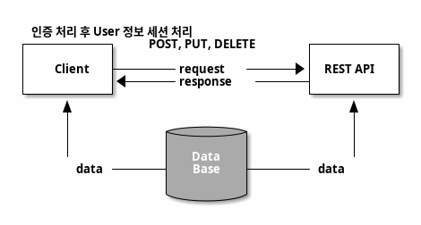
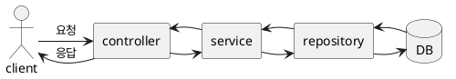
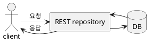

# 처음 배우는 스프링 부트2
##  6. 스프링 부트 데이터 레스트
REST(Representational State Transfer)는 웹의 장점을 극대화하는 통신 네트워크 아키텍처 이며  
REST의 구현 원칙을 제대로 지키는 시스템을 RESTful 이라고 함

## 6.1 배경지식
### 1. REST 소개
REST는 웹과 같은 분산 하이퍼미디어 시스템에서 사용하는 통신 네트워크 아키텍처로 네트워크 아키텍처의 원리 모음

웹은 전송 방식으로 HTTP를 식벽 방법으로 URI를 사용

HTTP는 웹에서 GET, POST, PUT, DELETE 등의 메서드를 사용하여 정보를 주고받는 프로토콜

REST는 HTTP와 URI의 단순하고 간결한 장점을 계승한 네트워크 아키텍처

#### REST의 목적
- 구성요소 상호작용의 규모 확장성
- 인터페이스의 범용성
- 구성요소의 독립적인 배포
- 중간적 구성요소를 이용한 응답 지연 감소, 보안 강화, 레거시 시스템 인캡슐레이션

### 2. RESTful 제약 조건
##### 클라이언트-서버(client-server)
이 제약 조건의 기본 원칙은 관심사의 명확한 분리  
관심사의 명확한 분리가 선행되면 서버의 구성요소가 단순화되고 확장성이 향상되어 여러 플랫폼을 지원할 수 있음

##### 무상태성(stateless)
서버에 클라이언트의 상태 정보를 저장하지 않는 것을 말함  
단순히 들어오는 요청만 처리하여 구현을 더 단순화함  
클라이언트의 모든 요청은 서버가 요청을 알아듣는 데 필요한 모든 정보를 담고 있어야 함

##### 캐시 기능(cacheable)
클라이언트의 응답을 캐시할 수 있어야 함  
앞에서 HTTP의 장점을 그대로 계승한 아키텍처가 REST라고 함  
HTTP의 캐시 기능도 적용할 수 있음

##### 계층화 시스템(layered system)
서버는 중개 서버(게이트웨이, 프록시)나 로드 밸런싱, 공유 캐시 등의 기능을 사용하여 확장성 있는 시스템을 구성할 수 있음

##### 코드 온 디맨드(code on demand)
클라이언트는 서버에서 자바 애플릿, 자바스크립트 실행 코드를 전송받아 기능을 일시적으로 확장할 수 있음  
이 제약 조건은 선택 가능함

##### 인터페이스 일관성(uniform interface)
URI(통합 자원 식별자)로 지정된 리소스에 균일하고 통일된 인터페이스를 제공함  
아키텍처를 단순하게 분리하여 독립적으로 만들 수 있음

#### 인터페이스 일관성
인터페이스 일관성은 세부 원칙을 갖고 있음  
인터페이스 일관성이 잘 지켜졌는지에 따라 REST를 제대로 사용했는지 판단할 수 있음

인터페이스 일관성의 4가지 프로퍼티
- 자원식별  
```
http://localhost:8080/resource/1
```
- 메시지를 통한 리소스 조작
```
http://localhost:8080/resource/1
content-type: application/json
```

- 자기 서술적 메시지
```
GET http://localhost:8080/resource/1
content-type: application/json
```

- 애플리케이션 상태에 대한 엔진으로서의 하이퍼미디어(hypermedia as the engine of application state.HATEOAS)  
HATEOAS는 클라이언트에 응답할 때 단순히 결과 데이터만 제공해주기보다는 URI를 함께 제공해야 한다는 원칙  
하이퍼텍스트 링크처림 관련된 리소스 정보를 포함한다
    - 클라이언트는 관련된 특정 동작에 따라 탐색할만한 URI 값을 알 수 있음  
    URI는 resource까지 포함하므로 더 명확하며 예측 가능하다
    - 키값이 변하지 않는 한 URI가 변경되더라도 동적으로 사용할 수 있다  
    따라서 서버쪽 코드가 변하더라도 클라이언트 코드를 따로 수정할 필요가 없다

REST의 제약 조건들을 제대로 지키면서 REST 아키텍처를 만드는 것을 **RESTFul** 이라고 함

### 3. REST API 설계하기
서버 한 대가 여러 클라이언트에 대응하려면 REST API가 필요함  
REST API는 다음과 같이 구성해야 함
- 자원(resource): URI
- 행위(verb): HTTP 메서드
- 표현(representations): 리소스에 대한 표현(HTTP Message Body)

#### URI 설계
URI는 웹에 있는 자원의 이름과 위치를 식별함  
URL은 URI의 하위 개념  
URL이 리소스를 가져오는 방법에 대한 위치라면 URI는 문자열을 식별하기 위한 표준

URI는 명사를 사용해야 하며 동사를 피해야 한다  
동사를 표현할 때는 HTTP 메서드인 GET, POST, PUT, DELETE 등으로 다음과 같이 대체해야 함
```
GET http://localhost:8080/api/books
content-type: application/json
```

#### 복수형을 사용하라
URI에서는 명사에 단수형보다는 복수형을 사용해야 함  
/book도 물론 명사고 사용 가능하지만 /books로 리소스를 표현하면 컬렉션(collection)으로 명확하게 표현할 수 있어  
확장성 측면에서 더 좋음
```
{
    books: [
        {
            book: ...
        },
        {
            book: ...
        },
        {
            book: ...
        },
    ]
}
```

컬렉션으로 URI를 사용할 경우 컬렉션을 한번 더 감싼 중첩(nested) 형식으로 사용하는 것이 좋음  
중첩할 경우 아래와 같이 JSON 형태로 _embedded 안에 컬렉션 데이터를 넣어서 반환하면 됨   
```
{
    _embedded: [
        {
            books: ...
        },
        {
            stores: ...
        },
        {...}
    ]
}
```
중첩된 형태로 _embedded 내부에 기존 컬렉션의 키값이 유지되게 보낼 경우 서버의 API 스펙이 변경되더라도  
클라이언트는 따로 코드를 수정할 필요가 없음

#### 행위 설계
| Resource | GET(read)          | POST(create)   | PUT(update)        | DELETE(delete)     |
| -------- | ------------------ | -------------- | :----------------- | ------------------ |
| /books   | book 목록 보기     | 해당 book 추가 | -                  | -                  |
| /books/1 | ID가 1인 book 보기 | -              | ID가 1인 book 수정 | ID가 1인 book 삭제 |

/books 자체가 복수의 book을 의미하므로 books를 게시판에 표현할 때 페이징을 처리하는 값을 추가로 제공할 수도 있음  
추가 값으로 페이지, 크기, 정렬 등의 파라미터를 지정할 수 있음  
아래와 같이 JPA의 Pageable의 프로퍼티 값을 그대로 사용할 수 있음
page, size, sort 파라미터를 따로 지정하지 않으면 서버에서 기본으로 설정한 값으로 반환됨
```
GET http://localhost:8080/api/books?page=0&size=10&sort=desc
content-type: application/json
```

## 6.2 설계하기
REST API를 MVC 패턴을 이용한 방법과 스프링 부트 데이터 레스트를 사용하는 방법으로 구현함


- 클라이언트와 DB가 기존에는 직접 데이터를 주고 받았음
- REST API를 사용하면 클라이언트와 DB 사이를 REST API가 중계하게 됨

REST API에서 노출하고 싶은 데이터만 노출할 수 있으며 데이터를 캐시하여 성능도 향상되는 구조까지 가질 수 있음  
따라서 기존에 직접 데이터를 주고받던 과정인 클라이언트와 DB가 데이터를 주고 받던 관계는 사라짐

### 1. MVC 패턴을 활용하는 방법



### 2. 스프링 부트 데이터 레스트를 활용하는 방법



## 6.3 스프링 부트 MVC 패턴으로 REST API 구현하기
1. 클라이언트와 REST API의 통신을 위한 클라이언트 쪽 스크립트 코드 추가
2. REST API 개발 환경 설정
3. CORS 허용 및 시큐리티 설정
4. 생성, 수정, 삭제 기능 구현

### 1. 준비하기
#### 스프링 부트 웹 수정
1. 커뮤니티 게시판의 /board/form.html Ajax 통신용 스크립트 추가
2. MySQL 런타임 의존성 추가
3. MySQL을 사용하도록 설정

#### 스프링 부트 데이터 레스트 구성
내부 멀티모듈로 구성
- rest-web: MVC 패턴 모듈
- data-rest: 데이터 레스트 방식의 모듈
1. settings.gradle 설정
   ```groovy
   rootProject.name = 'boot-rest'

   include 'data-rest'
   include 'rest-web'
   ```
2. build.gradle 설정

### 2. REST API 구현하기
1. REST API DataSource 및 포트 설정
```yaml
spring:
  datasource:
    url: jdbc:mysql://127.0.0.1:3306/testdb
    username: freelife1191
    password: 1
    driver-class-name: com.mysql.cj.jdbc.Driver
server:
  port: 8081
```

2. BoardType Enum 생성
3. Board 클래스 생성
4. SocialType Enum 생성
5. User 클래스 생성
6. BoardRepository 생성
7. UserRepository 생성
8. BoardRestController 생성

**PagedResources** 객체를 생성하면 링크를 추가한 RESTful 데이터를 생성한다  
인터페이스의 일관성을 위해 HATEOAS를 적용하여 관련 리소스 정보를 추가한다

HATEOAS 링크 예제
```json
"_links": {
    "first": {
        "href": "http://localhost:8081/api/boards?page=0&size=10"
    },
    "self": {
        "href": "http://localhost:8081/api/boards{?page,size,sort,projection}"
    },
    "next": {
        "href": "http://localhost:8081/api/boards?page=1&size=10"
    },
    "last": {
        "href": "http://localhost:8081/api/boards?page=20&size=10"
    }
}
```
- first: 첫 페이지
- self: 자기 자신의 URL의 파라미터 정보
- next: 다음 페이지
- last: 마지막 페이지

위와 같이 페이지 처리에 관련된 정보를 키/값 형식으로 추가할 수 있음  
만약 클라이언트가 위 키값을 사용하여 게시판 페이지의 로직을 처리했다면 관련 URL이 버전업 되거나  
형식이 바뀌더라도 클라이언트에서 따로 로직을 수정할 필요가 없음


http://localhost:8081/api/boards

Board 객체의 페이징 처리된 데이터 확인
```json
{
  "_embedded" : {
    "boards" : [ {
      "title" : "게시글1",
      "subTitle" : "순서1",
      "content" : "콘텐츠",
      "boardType" : "free",
      "createdDate" : "2019-09-02T23:12:06",
      "updatedDate" : "2019-09-02T23:12:06"
    }, {
      "title" : "게시글2",
      "subTitle" : "순서2",
      "content" : "콘텐츠",
      "boardType" : "free",
      "createdDate" : "2019-09-02T23:12:06",
      "updatedDate" : "2019-09-02T23:12:06"
    } ]
  },
  "_links" : {
    "self" : {
      "href" : "http://localhost:8081/api/boards"
    }
  },
  "page" : {
    "size" : 10,
    "totalElements" : 200,
    "totalPages" : 20,
    "number" : 0
  }
}
```