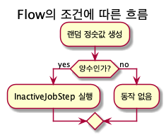

# 처음 배우는 스프링 부트2
##  7. 스프링 부트 배치
스프링 배치는 백엔드의 배치 처리 기능을 구현하는 데 사용하는 프레임워크  
스프링 부트 배치는 스프링 배치의 설정 요소들을 간편화시켜 스프링 배치를 빠르게 설정하는데 도움을 줌

## 7.1 배경지식
스프링 부트 배치는 스프링 본부인 Pivotal과 컨설팅 회사인 Accenture가 공동으로 개발했음  

### 1. 배치 처리에 스프링 부트 배치를 써야 하는 이유
##### 스프링 부트 배치의 장점
- 대용량 데이터 처리에 최적화되어 고성능을 발휘함
- 효과적인 로깅 통계 처리, 트랜잭션 관리 등 재사용이 가능한 필수 기능을 지원함
- 수동으로 처리하지 않도록 자동화되어 있음
- 예외사항과 비정상 동작에 대한 방어 기능이 있음
- 스프링 부트 배치의 반복되는 작업 프로세스를 이해하면 비즈니스 로직에 집중할 수 있음

### 2. 스프링 부트 배치 2.0
스프링 부트 배치 2.0은 최신 버전인 스프링 배치 4.0을 기반으로 함
##### 스프링 배치 4.0의 세 가지 특징
- 기본적으로 자바 8 이상에서 동작함
- 자바 8은 함수형 인터페이스와 람다를 지원해 한층 더 편리한 개발이 가능함
- 스프링 프레임워크 5로 진화하면서 새롭게 재배열된 의존성 트리를 지원함
- ItemReaders, ItemProcessors, ItemWriters에 대한 빌더를 제공함

### 3. 스프링 부트 배치의 주의사항
스프링 부트 배치는 스프링 배치를 간편하게 상요할 수 있게 래핑한 프로젝트임
##### 스프링 부트 배치와 스프링 배치의 주의사항
1. 가능하면 단순화해서 복잡한 구조와 로직을 피해야 함
2. 데이터를 직접 사용하는 작업이 빈번하게 일어나므로 데이터 무결성을 유지하는 유효성 검사 등의 방어책이 있어야 함
3. 배치 처리 시 시스템 I/O 사용을 최소화해야함  
  잦은 I/O로 데이터베이스 커넥션과 네트워크 비용이 커지면 성능에 영향을 줄 수 있기 때문임  
  따라서 가능하면 한번에 데이터를 조회하여 메모리에 저장해두고 처리를 한 다음 그 결과를 한번에 데이터베이스에 저장하는 것이 좋음
4. 일반적으로 같은 서비스에 사용되는 웹, API, 배치, 기타 프로젝트들은 서로 영향을 줌 
   따라서 배치 처리가 진행되는 동안 다른 프로젝트 요소에 영향을 주는 경우가 없는지 주의를 기울여야 함
5. 스프링 부트 배치는 스케쥴러를 제공하지 않음  
   배치 처리 기능만 제공하며 스케줄링 기능은 스프링에서 제공하는 쿼츠 프레임워크(Quartz Framework), IBM 티볼리(Tivoli) 스케줄러, BMC 컨트롤-M(Control-M) 등을 이용해야 함  
   리눅스 crontab 명령은 가장 간단히 사용할 수 있지만 이는 추천하지 않음  
   crontab의 경우 각 서버마다 따로 스케줄링을 관리해야 하며 무엇보다 클러스터링 기능이 제공되지 않음  
   반면에 쿼츠와 같은 스케줄링 프레임워크를 사용한다면 클러스터링뿐만 아니라 다양한 스케줄링 기능, 실행 이력 관리 등 여러 이점을 얻을 수 있음

## 7.2 스프링 부트 배치 이해하기
##### 배치의 일반적인 3단계 시나리오
1. 읽기(read): 데이터 저장소(일반적으로 데이터베이스)에서 특정 데이터 레코드를 읽음
2. 처리(processing): 원하는 방식으로 데이터를 가공/처리함
3. 쓰기(write): 수정된 데이터를 다시 저장소(데이터베이스)에 저장함


Job 이라는 하나의 큰 일감(Job)에 여러 단계(Step)를 두고, 각 단계를 배치의 기본 흐름대로 구현함

### 1. Job
Job은 배치 처리 과정을 하나의 단위로 만들어 표현한 객체  
전체 배치 처리에 있어 항상 최상단 게층에 있음

스프링 배치에서 Job 객체는 여러 Step 인스턴스를 포함하는 컨테이너

여러 빌더를 통합하는 처리 공장인 `JobBuilderFactory`로 원하는 Job을 손쉽게 만들 수 있음  
`JobBuilderFactory`의 `get()` 메서드로 `JobBuilder`를 생성하고 이를 이용함

##### JobBuilderFactory 클래스
```java
public class JobBuilderFactory {
  private JobRepository jobRepository;

  public JobBuilderFactory(JobRepository jobRepository) {
    this.jobRepository = jobRepository;
  }

  public JobBuilder get(String name) {
    JobBuilder builder = new JobBuilder(name).repository(jobRepository);
    return builder;
  }
}
```
`JobBuilderFactory`는 `JobBuilder`를 생성하는 역할만 수행함

##### JobBuilder의 메서드
```java
/**
 * Step을 추가해서 가장 기본이 되는 SimpleJobBuilder를 생성함
 */
public SimpleJobBuilder start(Step step) {
  return new SimpleJobBuilder(this).start(step);
}

/**
 * Flow를 실행할 JobFlowBuilder를 생성함
 */
public JobFlowBuilder start(Flow flow) {
  return new FlowJobBuilder(this).start(flow);
}

/**
 * Step을 실행할 JobFlowBuilder를 생성함
 */
public JobFlowBuilder flow(Step step) {
  return new FlowJobBuilder(this).start(Step);
}
```
`JobBuilder`는 직접적으로 `Job`을 생성하는 거시 아니라 별도의 구체적인 빌더를 생성하여 반환함  
`Job`을 생성하기 위한 `Step` 또는 `Flow`를 파라미터로 받아 구체적인 빌더를 생성함  
`Job`은 `Step` 또는 `Flow` 인스턴스의 컨테이너 역할을 하기 떄문에 생성하기 전에 인스턴스를 전달받음

##### SimpleJobBuilder를 활용한 Job 생성 예제 코드
```java
@Autowired
private JobBuilderFactory jobBuilderFactory;

@Bean
public Job simpleJob() {
  return jobBuilderFactory.get("simpleJob")
      .start(simpleStep());
      .build();
}
```

#### JobInstance
`JobInstance`는 배치에서 `Job`이 실행될 때 하나의 `Job` 실행 단위
각각의 `JobInstance`는 하나의 `JobExecution`(`JobInstance`에 대한 한 번의 실행을 나타내는 객체)

`Job` 실행이 실패하면 `JobInstance`이 끝난 것으로 간주하지 않고 다시 실행함  
`JobInstance`는 성공과 실패한 `JobExecution` 여러 개를 가질 수 있음

#### JobExecution
`JobExecution`은 `JobInstance`에 대한 한 번의 실행을 나타내는 객체  
`Job`을 실행할 때 같은 `JobInstance`를 사용하여 각기 다른 `JobExecution`을 생성함
`JobExecution` 인터페이스를 보면 `Job` 실행에 대한 정보를 담고 있는 도메인 객체라는 것을 알 수 있음

`JobExecution`은 `JobInstance`, 배치 실행 상태, 시작 시간, 끝난 시간, 실패했을 때의 메시지 등의 정보를 담고 있음

##### JobExecution 인터페이스
```java
public class JobExecution extends Entity {

	private final JobParameters jobParameters;
	private JobInstance jobInstance;
	private volatile Collection<StepExecution> stepExecutions = Collections.synchronizedSet(new LinkedHashSet<>());
	private volatile BatchStatus status = BatchStatus.STARTING;
	private volatile Date startTime = null;
	private volatile Date createTime = new Date(System.currentTimeMillis());
	private volatile Date endTime = null;
	private volatile Date lastUpdated = null;
	private volatile ExitStatus exitStatus = ExitStatus.UNKNOWN;
	private volatile ExecutionContext executionContext = new ExecutionContext();
	private transient volatile List<Throwable> failureExceptions = new CopyOnWriteArrayList<>();
	private final String jobConfigurationName;
}
```
- **jobParameters**: `Job` 실행에 필요한 매개변수 데이터
- **jobInstance**: `Job` 실행의 단위가 되는 객체
- **stepExecutions**: **StepExecution**을 여러 개 가질 수 있는 Collection 타입
- **status**: `Job`의 실행 상태를 나타내는 필드
  상탯값은 `COMPLETED`, `STARTING`, `STARTED`, `STOPPING`, `STOPPED`, `FAILED`, `ABANDONED`, `UNKNOWN` 등이 있으며 기본값은 `STARTING`
- **startTime**: `Job`이 실행된 시간 `null`이면 시작하지 않았다는 것을 나타냄
- **createTime**: `JobExecution`이 생성된 시간
- **endTime**: `JobExecution`이 끝난 시간
- **lastUpdated**: 마지막으로 수정된 시간
- **exitStatus**: `Job` 실행 결과에 대한 상태를 나타냄
  상탯값은 `UNKNOWN`, `EXECUTING`, `COMPLETED`, `NOOP`, `FAILED`, `STOPPED` 등이 있으며 기본값은 `UNKNOWN`
- **executionContext**: `Job` 실행 사이에 유지해야 하는 사용자 데이터가 들어 있음
- **failureExecutions**: `Job` 실행 중 발생한 예외를 **List** 타입으로 저장함
- **jobConfigurationName**: `Job` 설정 이름을 나타냄

#### JobParameters
`JobParameters`는 `Job`이 실행될 때 필요한 파라미터들을 **Map** 타입으로 저장하는 객체

`JobParameters`는 `JobInstance`를 구분하는 기준이 되기도 함  
`JobInstance`와 `JobParameters`는 **1:1** 관계임  
파라미터의 타입으로는 `String`, `Long`, `Date`, `Double`을 사용할 수 있음

### 2. Step
`Step`은 실질적인 배치 처리를 정의하고 제어하는 데 필요한 모든 정보가 들어 있는 도메인 객체

`Job`을 처리하는 실질적인 단위  
모든 `Job`에는 1개 이상의 `Step`이 있어야 함

#### StepExecution
`Step` 실행 정보를 담는 객체  
각각의 `Step`이 실행될 때마다 `StepExecution`이 생성됨

##### StepExecution 클래스
```java
public class StepExecution extends Entity {

	private final JobExecution jobExecution;
	private final String stepName;
	private volatile BatchStatus status = BatchStatus.STARTING;
	private volatile int readCount = 0;
	private volatile int writeCount = 0;
	private volatile int commitCount = 0;
	private volatile int rollbackCount = 0;
	private volatile int readSkipCount = 0;
	private volatile int processSkipCount = 0;
	private volatile int writeSkipCount = 0;
	private volatile Date startTime = new Date(System.currentTimeMillis());
	private volatile Date endTime = null;
	private volatile Date lastUpdated = null;
	private volatile ExecutionContext executionContext = new ExecutionContext();
	private volatile ExitStatus exitStatus = ExitStatus.EXECUTING;
	private volatile boolean terminateOnly;
	private volatile int filterCount;
	private transient volatile List<Throwable> failureExceptions = new CopyOnWriteArrayList<Throwable>();
}
```
- **jobExecution**: 현재의 `JobExecution` 정보를 담고 있는 필드
- **stepName**: `Step`의 이름을 가지고 있는 필드
- **status**: `Step`의 실행 상태를 나타내는 필드
  상탯값은 `COMPLETED`, `STARTING`, `STARTED`, `STOPPING`, `STOPPED`, `FAILED`, `ABANDONED`, `UNKNOWN` 등이 있으며 기본값은 `STARTING`
- **readCount**: 성공적으로 읽은 레코드 수
- **writeCount**: 성공적으로 쓴 레코드 수
- **commitCount**: `Step`의 실행에 대한 커밋된 트랜잭션 수
- **rollbackCount**: `Step`의 실행에 대해 롤백된 트랜잭션 수
- **readSkipCount**: 읽기에 실패해 건너뛴 레코드 수
- **processSkipCount**: 프로세스가 실패해 건너뛴 레코드 수
- **writeSkipCount**: 쓰기에 실패해 건너뛴 레코드 수
- **startTime**: `Step`이 실행된 시간 `null`이면 시작하지 않았다는 것을 나타냄
- **endTime**: `Step`의 실행 성공 여부와 관련 없이 `Step`이 끝난 시간
- **lastUpdated**: 마지막으로 수정된 시간
- **executionContext**: `Step` 실행 사이에 유지해야 하는 사용자 데이터가 들어 있음
- **exitStatus**: `Step` 실행 결과에 대한 상태를 나타냄
  상탯값은 `UNKNOWN`, `EXECUTING`, `COMPLETED`, `NOOP`, `FAILED`, `STOPPED` 등이 있으며 기본값은 `UNKNOWN`
- **terminateOnly**: `Job` 실행 중지 여부
- **filterCount**: 실행에서 필터링된 레코드 수
- **failureExeptions**: `Step` 실행 중 발생한 예외를 **List** 타입으로 지정

### 3. JobRepository
`JobRepository`는 배치 처리 정볼르 담고 있는 매커니즘  
어떤 `Job`이 실행되었으며 몇 번 실행되었고 언제 끝났는지 등 배치 처리에 대한 메타데이터를 저장

`JobRepository`는 `Step`의 실행 정보를 담고 있는 `StepExecution`도 저장소에 저장하며 전체 메타데이터를 저장/관리하는 역할을 수행

### 4. JobLauncher
`JobLauncher`는 `Job`, `JobParameters`와 함께 배치를 실행하는 인터페이스

##### JobLauncher 인터페이스
```java
public interface JobLauncher {
	public JobExecution run(Job job, JobParameters jobParameters) throws JobExecutionAlreadyRunningException,
			JobRestartException, JobInstanceAlreadyCompleteException, JobParametersInvalidException;
}
```
매개변수가 이전과 동일하면서 이전에 `JobExecution`이 중단된 적이 있다면 동일한 `JobExecution`을 반환

### 5. ItemReader
ItemReader는 Step의 대상이 되는 배치 데이터를 읽어오는 인터페이스  
FILE, XML, DB등 여러 타입의 데이터를 읽어올 수 있음

##### ItemReader 인터페이스
```java
public interface ItemReader<T> {
	T read() throws Exception, UnexpectedInputException, ParseException, NonTransientResourceException;
}
```
`ItemReader`에서 `read()` 메서드의 반환 타입을 제네릭으로 구현했기 때문에 직접 타입을 지정할 수 있다

### 6. ItemProcessor
ItemProcessor는 ItemReader로 읽어온 배치 데이터를 변환하는 역할을 수행함

##### ItemProcessordmf 따로 제공하는 이유
- 비즈니스 로직을 분리하기 위함  
  `ItemWriter`는 저장만 수행하고 `ItemProcessor`는 로직 처리만 수행해 역할을 명확하게 분리
- 읽어온 배치 데이터와 쓰여질 데이터의 타입이 다를 경우에 대응하기 위함  
  명확한 인풋과 아웃풋을 `ItemProcessor`로 구현

##### ItemProcessor 인터페이스
```java
public interface ItemProcessor<I, O> {
	O process(I item) throws Exception;
}
```

### 7. ItemWriter
`ItemWriter`는 배치 데이터를 저장함  
일반적으로 DB나 파일에 저장함

##### ItemWriter 인터페이스
```java
public interface ItemWriter<T> {
	void write(List<? extends T> items) throws Exception;
}
```

## 7.3 스프링 부트 휴면회원 배치 설계하기
커뮤니티에 가입한 회원중 1년이 지나도록 상태 변화가 없는 회원을 휴면회원으로 전환하는 배치 개발


1. H2 DB에 저장된 데이터 중 1년간 업데이트되지 않은 사용자를 찾는 로직을 ItemReader로 구현
2. 대상 사용자 데이터의 상탯값을 휴면회원으로 전환하는 프로세스를 ItemProcessor에 구현
3. 상탯값이 변한 휴면회원을 실제로 DB에 저장하는 ItemWriter를 구현

## 7.4 스프링 부트 배치 설정하기
배치 프로젝트 생성 'Spring-Boot-Community-Bathch'

1. build.gradle 의존성 설정
2. UserStatus, SocialType Enum
3. Grade Enum
4. User 클래스

## 7.5 스프링 부트 휴면회원 배치 구현하기
1. 휴면회원 배치 테스트 코드 생성
2. 휴면회원 배치 정보 설정
3. SQL로 테스트 데이터 주입하기

### 1. 휴면회원 배치 테스트 코드 생성
1. JobLuncherTestUtils 설정 - TestJobConfig.java
	#### `@EnableBatchProcessing`
	스프링 부트 배치 스타터에 미리 정의된 설정들을 실행시키는 마법의 어노테이션  
	배치에 필요한 JobBuilder, StepBuilder, JobRepository, JobLauncher 등 다양한 설정이 자동으로 주입됨
2. 휴면회원 전환 테스트 코드 작성 - InactiveUserJobTest.java
3. 타깃 휴면회원 검색 쿼리 생성 - UserRepository.java

### 2. 휴면회원 배치 정보 설정
아래의 순서로 Job 설정 만들기 
1. 휴면회원 Job 설정
2. 휴면회원 Step 설정
3. 휴면회원 Reader, Processor, Writer 설정

배치 정보는 `@Configuration` 어노테이션을 사용하는 설정 클래스에 빈으로 등록함

##### 1. 휴면회원 배치 Job 빈으로 등록(휴면회원 배치 Job 생성 메서드 추가) - InactiveUserJobConfig.java
- Job 생성을 직관적이고 편리하게 도와주는 빌더인 JobBuilderFactory를 주입  
  빈에 주입할 객체를 파라미터로 명시하면 @Autowired 어노테이션을 쓰는 것과 같은 효과가 있음
- JobBuilderFactory의 get("inactiveUserJob")은'inactiveUserJob'이라는 이름의 JobBuilder를 생성  
  preventRestart()는 Job의 재실행을 막음
- start(inactiveJobStep)은 파라미터에서 주입받은 휴면회원 관련 Step인 inactiveJobStep을 제일 먼저 실행하도록 설정하는 부분임  
  inactiveJobStep은 앞선 inactiveUserJob과 같이 InactiveUserJobConfig 클래스에 빈으로 등록
##### 2. 휴면회원 배치 Step 빈으로 등록(휴면회원 배치 Step 생성 메서드 추가) 
- StepBuilderFactory의 get("inactiveUserStep")은 'inactiveUserStep'이라는 이름의 StepBuilder를 생성함
- 제네릭을 사용해 chunk()의 입력 타입과 출력 타입을 User 타입으로 설정했음  
  chunk의 인잣값은 10으로 설정했는데 쓰기 시에 청크 단위로 묶어서 writer() 메서드를 실행시킬 단위를 지정한 것  
	즉, 커밋의 단위가 10개 임
- Step의 reader.processor.writer를 각각 설정했음
##### 3. 휴면회원 배치 Reader 빈으로 등록(휴면회원 배치 Reader 생성 메서드 추가)
- 기본 빈 생성은 싱글턴이지만 @StepScope를 사용하면 해당 메서드는 Step의 주기에 따라 새로운 빈을 생성함  
  즉, 각 Step의 실행마다 새로운 빈을 만들기 때문에 지연 생성이 가능함  
	주의할 사항은 @StepScope는 기본 프록시 모드가 반환되는 클래스 타입을 참조하기 때문에 @StepScope를 사용하면 반드시 구현된 반환 타입을 명시해 반환해야 함  
	여기서는 반환 타입을 `QueueItemReader<User>`라고 명시했음
- 현재 날짜 기준 1년 전의 날짜값과 User의 상태값이 ACTIVE인 User 리스트를 불러오는 쿼리
- QueueItemReader 객체를 생성하고 불러온 휴면회원 타깃 대상 데이터를 객체에 넣어 반환
##### 4. 큐를 사용한 Reader 객체 QueueItemReader를 별도로 생성 - QueueItemReader.java
- QueueItemReader를 사용해 휴면회원으로 지정될 타깃 데이터를 한번에 불러와 큐에 담아놓음
- read() 메서드를 사용할 때 큐의 poll() 메서드를 사용하여 큐에서 데이터를 하나씩 반환함
##### 5. 휴면회원으로 전환시키는 inactiveUserProcessor 생성 메서드 추가
- reader에서 읽은 User를 휴면 상태로 전환하는 processor 메서드
##### 6. 휴면회원을 DB에 저장하는 inactiveUserWriter 생성 메서드 추가
- 휴면회원을 DB에 저장
- 리스트 타입을 앞서 설정한 청크 단위로 받음
- 청크 단위를 10으로 설정했으므로 users에는 휴면회원 10개가 주어지며 saveAll() 메서드를 사용해서 한번에 DB에 저장함
##### 7. BatchApplication 클래스에 `@EnableBatchProcessing` 어노테이션 추가
- 배치 작업에 필요한 빈을 미리 등록하여 사용할 수 있도록 해줌

### 3. SQL로 테스트 데이터 주입하기
스프링 부트에서 SQL 파일을 이용해 테스트 데이터를 생성하여 저장

##### 휴면회원의 대상에 대한 데이터 삽입 쿼리를 `import.sql` 파일로 생성
**/resources** 하위 경로에 `import.sql` 파일을 생성해놓으면 스프링 부트가 실행될 때 자동으로 해당 파일의 쿼리를 실행함  
`import.sql`은 하이버네이트가 `data.sql`은 스프링 jdbc가 실행함

## 7.6 스프링 배치 심화학습
1. 다양한 ItemReader 구현 클래스
2. 다양한 ItemWriter 구현 클래스
3. JobParameter 사용하기
4. 테스트 시에만 H2 DB를 사용하도록 설정하기
5. 청크 지향 프로세싱
6. 배치의 인터셉터 Listener 설정하기
7. 어노테이션 기반으로 Listener 설정하기
8. Step의 흐름을 제어하는 Flow

### 1. 다양한 ItemReader 구현 클래스
스프링 배치 프로젝트에서는 각각의 상황에 맞는 다양한 `ItemReader` 구현체를 제공함  
그 중 하나가 리스트 타입으로 Reader를 구현한 `ListItemReader` 객체임  
`QueueItemReader` 객체와 동일한 역할을 수행함

#### 배치 프로젝트에서 제공하는 ListItemReader 객체 사용하기
`ListItemReader` 객체를 사용하면 모든 데이터를 한번에 가져와 메모리에 올려놓고 `read(`) 메서드로 하나씩 배치 처리 작업을 수행할 수 있음

수백, 수천을 넘어 수십만 개 이상의 데이터를 한번에 가져와 메모리에 올려놓아야 할 때는 `PagingItemReader` 구현체를 사용할 수 있음  
구현체는 `JdbcPagingItemReader`, `JpaPagingItemReader`, `HibernatePagingItemReader` 가 있음  

`JpaPagingItemReader`에는 지정한 데이터 크기만큼 DB에서 읽어오는 `setPageSize()` 메서드라는 기능이 있음  
모든 데이터를 한번에 가져오는 것이 아니라 지정한 단위로 가져와 배치 처리를 수행함

#### JpaPagingItemReader를 사용해 원하는 크기만큼 읽어오기
1. 스프링에서 `destroyMethod`를 사용해 삭제할 빈을 자동으로 추적함  
	 `destroyMethod=""`와 같이 하여 기능을 사용하지 않도록 설정하면 실행 시 출력되는 다음과 같은 **warning** 메시지를 삭제할 수 있다
2. `JpaPagingItemReader`를 사용하려면 쿼리를 직접 짜서 실행하는 방법밖에 없음
	 마지막 정보 갱신 일자를 나타내는 **updatedDate** 파라미터와 상태값을 나타내는 **status** 파라미터를 사용해 쿼리를 작성함
3. 쿼리에서 사용된 **updatedDate.status** 파라미터를 Map에 추가해 사용할 파라미터를 설정함
4. 트랜잭션을 관리해줄 `entityManagerFactory` 를 설정함
5. 한번에 읽어올 크기를 15개로 설정함

##### ▶ 주의사항
`JpaPagingItemReader` 는 내부에 **entityManager** 를 할당받아 사용하는데 지정한 크기로 데이터를 읽어옴

**inactiveJobStep()** 에서 설정한 청크단위가 5개라면 item 5를 writer까지 패치처리르 진행하고 저장한뒤  
저장된 데이터를 바탕으로 다음에 다시 지정한 크기로 새 인덱스를 할당해 읽어 와야 하는데  
entityManager에서 앞서 처리된 item 5개 때문에 새로 불러올 Item의 인덱스 시작점이 5로 설정되어 있게 됨

청크 단위로 Item 5개를 커밋하고 다음 청크 단위로 넘어가야 하는 경우
쿼리 요청시 offset 5(인덱스값), limit 5(지정한 크기 단위)이므로 개념상 바로 다음 청크 단위(Item 5개)인 Item을 건너뛰는 상황이 발생함

##### 해결방법
조회용 인덱스값을 항상 0으로 반환하여 item 5개를 수정하고
다음 5개를 건너뛰지 않고 원하는 순서/청크 단위로 처리가 가능해짐

### 2. 다양한 ItemWriter 구현 클래스
JPA를 사용하고 있으므로 JpaItemWriter를 적용

제네릭에 저장할 타입을 명시하고 EntityManagerFactory만 설정하면 Processor에서 넘어온 데이터를 청크 단위로 저장함

### 3. JobParameter 사용하기
`JobParameter`를 사용해 **Step**을 실행시킬 때 동적으로 파라미터를 주입시킬 수 있음

휴면회원으로 전환하는 배치 로직에서 현재 시간 기준으로 1년 전의 날짜를 값으로 사용해 휴면전환 **User**를 조회했음

청크 단위로 **Reader**가 실행될 때마다 미세하게 현재 날짜값이 차이날 수 있음

`JobParameter`에 현재 시간을 주입해 **Reader**가 실행될 때 마다 모두 동일한 시간을 참조하게 설정

#### 현재 시간에 대한 JobParameter 생성
- 현재 날짜를 Date 타입으로 생성함
	Date 타입은 JobParameter에서 허용하는 파라미터 중 하나임
- JobParametersBuilder를 사용하면 간편하게 JobParameters를 생성할 수 있음
	JobParameters는 여러 JobParameter를 받는 객체임
	JobLauncher를 사용하려면 JobParameters가 필요함

#### inactiveUserReader() 메서드에서 JobParameter 사용하기
- SpEL을 사용해 JobParameters에서 nowDate 파라미터를 전달받음
	Date 타입으로 주입해서 곧바로 Date 타입으로 전달받을 수 있음
- 전달받은 현재 날짜값을 UserRepository에서 사용할 수 있는 타입인 LocalDateTime으로 전환함

### 4. 테스트 시에만 H2 데이터베이스를 사용하도록 설정하기

#### 1. MySQL 의존성 추가
build.gradle 파일에 MySQL 런타임 의존성 추가 설정

```groovy
runtime('mysql:mysql-connector-java')
```

#### 2. `application.yml`에 MySQL을 사용하도록 설정
```yaml
spring:
  datasource:
    url: jdbc:mysql://127.0.0.1:3306/{DB명}
    username: {아이디}
    password: {패스워드}
    driver-class-name: com.mysql.cj.jdbc.Driver
  jpa:
    show-sql: true
    hibernate:
			# 테스트용 테이블 생성 설정(애플리케이션 재기동 시 테이블이 삭제 되고 새롭게 생성됨)
      ddl-auto: create
```

#### 3. `@AutoConfigureTestDatabase`를 사용해서 테스트 데이터베이스 설정
datasource 프로퍼티를 기반으로 자동으로 설정된 데이터베이스를 무시하고 테스트용 클래스에서 사용할 데이터베이스가 적용되게 함

```java
...
import org.springframework.boot.jdbc.EmbeddedDatabaseConnection;
import org.springframework.boot.test.autoconfigure.jdbc.AutoConfigureTestDatabase;

@RunWith(SpringRunner.class)
@SpringBootTest
// 테스트 시에는 H2를 사용하도록 설정
@AutoConfigureTestDatabase(connection = EmbeddedDatabaseConnection.H2)
public class InactiveUserJobTest {
	...
}
```

### 5. 청크 지향 프로세싱
청크 지향 프로세싱(chunk oriented processing)은 트랜잭션 경계 내에서 청크 단위로 데이터를 읽고 생성하는 프로그래밍 기법

청크란 아이템이 트랜잭션에서 커밋되는 수

read한 데이터 수가 지정한 청크 단위와 일치하면 write를 수행하고 트랜잭션을 커밋함

##### 청크 지향 프로세싱의 이점
1000여 개의 데이터에 대해 배치 로직을 실행한다고 가정할 때 청크로 나누지 않았을 때는 하나만 실패해도 다른 성공한 999개의 데이터가 롤백되지만  
청크 단위를 10으로 해서 배치 처리르 하면 도중에 배치 처리에 실패 하더라도 다른 청크는 영향을 받지 않음

#### 청크 지향 프로세싱 프로세스


##### 청크 지향 프로세싱이 아닌 방식
Tasklet를 사용한 방식

Tasklet은 임의의 Step을 실행할 떄 하나의 작업으로 처리하는 방식

읽기, 처리, 쓰기로 나뉜 방식이 청크 지향 프로세싱이라면 이를 단일 작업으로 만드는 개념이 Tasklet 임

#### Tasklet 인터페이스
```java
public interface Tasklet {
	@Nullable
	RepeatStatus execute(StepContribution contribution, ChunkContext chunkContext) throws Exception;
}
```
`Tasklet` 인터페이스는 `execute()` 메서드 하나만 제공함

내부에 원하는 단일 작업을 구현하고 작업이 끝나면 `RepeatStatus.FINISHED`를 반환하고  
작업이 계속된다면 `RepeatStatus.CONTINUABLE`을 반환함

#### 휴면회원 배치 처리를 Tasklet으로 전환
기존의 읽기 -> 처리 -> 쓰기로 진행되었던 청크 지향 프로세싱 방식의 구조를 하나로 합쳐놓음

### 6. 배치의 인터셉터 Listener 설정하기
배치 흐름에서 전후 처리를 하는 Listener를 설정
- Job의 전후 처리
- Step의 전후 처리
- 각 청크 단위에서의 전후 처리

특정 로직을 할당해 제어할 수 있음

스프링 배치에서는 Job의 Listener로 `JobExecutionListener` 인터페이스를 제공함

#### 1. Job의 실행과 종료 메시지를 출력하는 InactiveJobListener 구현
#### 2. Job 설정에 Listener 등록하기
Job 정보를 설정하는 `inactiveUserJob()` 메서드에 `InactiveIJobListener`를 추가 했음

#### 배치에서 제공되는 Listener 인터페이스와 어노테이션

| 인터페이스명            | 어노테이션                                                   | 설명                                                         |
| ----------------------- | ------------------------------------------------------------ | ------------------------------------------------------------ |
| `JobExecutionListener`  | `@BeforeJob`<br />`@AfterJob`                                | Job 실행 전후 처리를 담당하는 Listener 설정                  |
| `ChunkListener`         | `@BeforeChunk`<br />`@AfterChunk`<br />`@AfterChunkError`    | Chunk 실행 전후 처리 및 에러 발생 시 처리를 담당하는 Listener 설정 |
| `ItemReadListener`      | `@BeforeRead`<br />`@AfterRead`<br />`@OnReadError`          | Read 과정 전후 처리 및 에러 발생 시 처리를 담당하는 Listener 설정 |
| `ItemProcessListener`   | `@BeforeProcess`<br />`@AfterProcess`<br />`@OnProcessError` | Process 과정 전후 처리 및 에러 발생 시 처리를 담당하는 Listener 설정 |
| `ItemWriteListener`     | `@BeforeWrite`<br />`@AfterWrite`<br />`@OnWriteError`       | Write 과정 전후 처리 및 에러 발생 시 처리를 담당하는 Listener 설정 |
| `StepExecutionListener` | `@BeforeStep`<br />`@AfterStep`                              | Step 실행 전후 처리를 담당하는 Listener 설정                 |
| `SkipListener`          | `@OnSkipInRead`<br />`@OnSkipInWrite`<br />`@OnSkipInProcess` | Step 실행 전후 처리를 담당하는 Listener 설정<br /><br />배치 처리 중 Skip이 발생했을 때를 담당하는 Listener 설정 |

### 7. 어노테이션 기반으로 Listener 설정하기
인터페이스 대신 어노테이션을 사용해 Listener 설정

Step 실행 전후 처리 어노테이션인 `@BeforeStep`, `@AfterStep`을 사용해 Step 시작 전후에 로그 메시지를 출력

#### 1. 어노테이션을 사용한 InactiveStepListener 생성
**StepExecutionListener** 인터페이스를 구현하지 않고 `@BeforeStep`, `@AfterStep` 어노테이션을 사용해 동작하도록 만듬

#### 2. Step 설정에 Listener 등록하기
**InactiveStepListener**를 Step의 Listener로 설정하는 코드

**inactiveJobStep** 빈의 설정에서 listener(InactiveStepListener)를 추가해 **InactiveStepListener**등록

### 8. Step의 흐름을 제어하는 Flow
Step 과정의 가장 기본은 '읽기-처리-쓰기' 

스프링 배치에서는 흐름을 제어하는 Flow를 제공함  
특정 조건에 따라 Step의 실행 여부를 정할 수 있음

#### Flow의 조건에 따른 흐름


흐름에서 조건에 해당하는 부분을 `JobExecutionDecider` 인터페이스를 사용해 구현할 수 있음

`JobExecutionDecider` 인터페이스는 `decide()` 메서드 하나만 제공함

##### JobExecutionDecider 인터페이스
```java
public interface JobExecutionDecider {
	FlowExecutionStatus decide(JobExecution jobExecution, @Nullable StepExecution stepExecution);
}
```

#### 1. InactiveJobExecutionDecider 구현하기
- Random 객체를 사용해 랜덤한 정숫값을 생성하고 양수인지 확인함
- 양수면 FlowExecutionStatus.COMPLETED를 반환함
- 음수면 FlowExecutionStatus.FAILED를 반환함

#### 2. 조건에 따라 Step의 실행 여부를 처리하는 inactiveJobFlow 설정하기
inactiveUserJob() 메서드에서는 Step이 아닌 Flow를 주입받고  
주입받을 Flow를 inactiveJobFlow() 메서드를 통해 빈으로 등록함

1. FlowBuilder를 사용하면 Flow 생성을 한결 편하게 할 수 있음
   FlowBuilder의 생성자에 원하는 Flow 이름을 넣어서 생성함
	 여기서는 'inactiveJobFlow'로 설정
2. 생성한 조건을 처리하는 InactiveJobExecutionDecider 클래스를 start로 설정해 맨 처음 시작하도록 지정함
3. InactiveJobExecutionDecider 클래스의 decide() 메서드를 거쳐 반환값으로 FlowExecutionStatus.FAILED가 반환되면 end()를 사용해 곧바로 끝나도록 설정
4. InactiveJobExecutionDecider 클래스의 decide() 메서드를 거쳐 반환값으로 FlowExecutionStatus.COMPLETED가 반환되면 기존에 설정한 inactiveJobStep을 실행하도록 설정
5. inactiveUserJob 시작 시 Flow를 거쳐 Step을 실행하도록 inactiveJobFlow를 start()에 설정

## 7.7 멀티 스레드로 여러 개의 Step 실행하기
보통은 배치 처리당 스레드 하나만 실행할 경우가 대부분이지만 상황에 따라 여러 Step을 동시에 실행하는 경우도 있음

스프링 부트 배치에서 멀티 스레드로 Step을 실행하는 전략

- `TaskExecutor`를 사용해 여러 Step 동작시키기
- 여러 개의 Flow 실행시키기
- 파티셔닝을 사용한 병렬 프로그래밍

### 1. `TaskExecutor`를 사용해 여러 Step 동작시키기
`TaskExecutor` 인터페이스는 멀티 스레드로 Step을 실행하는 가장 기본적인 방법임

Task는 Runnable 인터페이스를 구현해 각각의 스레드가 독립적으로 실행되도록 작업을 할당하는 객체임

스프링에서는 이러한 Task를 실행하는 객체를 `TaskExecutor` 인터페이스를 통해 구현하도록 정의했음

스레드를 요청할 때마다 스레드를 새로 생성하는 `SimpleAsyncTaskExecutor` 객체를 사용

#### Step 설정에 TaskExecutor 등록하기
휴면회원 배치 처리에 `TaskExecutor`를 등록해 멀티 스레드로 실행하도록 설정

1. 빈으로 생성한 `TaskExecutor` 등록

2. `throttleLimit` 설정은 '**설정된 제한 횟수만큼만 스레드를 동시에 실행시키겠다**'는 뜻임  
	 시스템에 할당된 스레드 풀의 크기보다 작은 값으로 설정되어야 함  
 	 만약 1로 설정하면 기존의 동기화 방식과 동일한 방식으로 실행됨  
	 2로 설정하면 스레드르 2개씩 실행시킴

3. `SimpleAsyncTaskExecutor`를 생성해 빈으로 등록함
   생성자의 매개변수로 들어가는 값은 Task에 할당되는 이름이 됨
   기본적으로 첫 번째 Task는 '**Batch_Task1**'이라는 이름으로 할당되며 뒤에 붙는 숫자가 하나씩 증가하며 이름이 정해짐

### 2. 여러 개의 Flow 실행시키기
Flow를 멀티 스레드로 실행시키는 방법

휴면회원으로 전환될 회원 데이터를 기간별로 나눠서 각각 스레드별로 처리하는 방법이 적절

#### SimpleAsyncTaskExecutor 빈으로 등록
```java
@Configuration
public class InactiveUserJobConfig {

		...
    private TaskExecutor taskExecutor;

    public InactiveUserJobConfig(EntityManagerFactory entityManagerFactory) {
        ...
        this.taskExecutor = new SimpleAsyncTaskExecutor("Batch_Task");
    }
```

#### 멀티 Flow 설정하기
1. 빈으로 등록한 **multiFlow** 설정으로 시작

2. `IntStream`을 이용해 flows 배열의 크기(5개)만큼 반복문을 돌림
   `FlowBuilder` 객체로 Flow(inactiveJobFlow) 5개를 생성해서 flows 배열에 할당함

3. **multiFlow**에서 사용할 `TaskExecutor`를 등록함

4. `inactiveJobFlow` 5개가 할당된 flows 배열을 추가함

5. 기본의 **inactiveJobFlow**는 빈으로 등록되어 있음
   빈은 기본적으로 싱글턴으로 등록되기 때문에 여러 **inactiveJobFlow**를 각각 생성하려면
	 `@Bean` 어노테이션을 제거하여 빈이 아닌 일반 객체를 생성해 반환하도록 설정해야 함